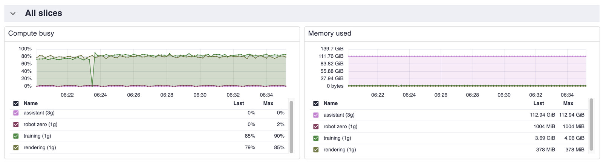
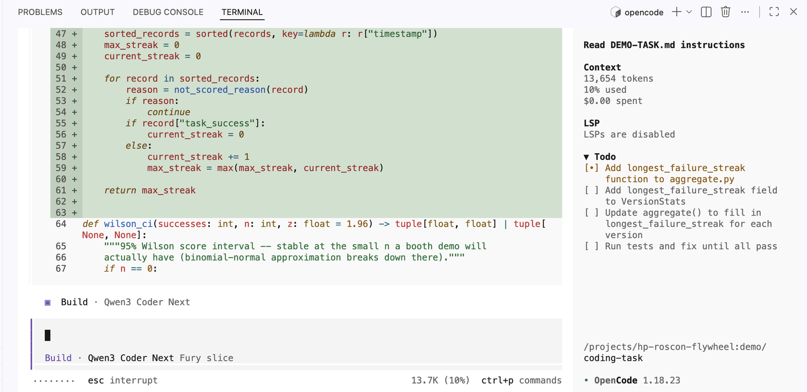
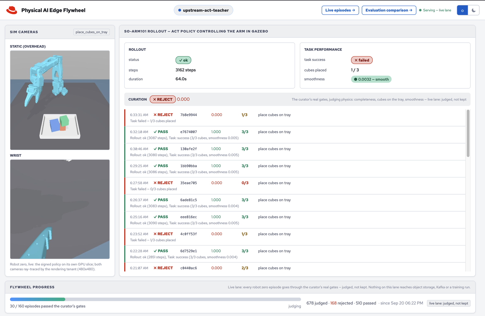
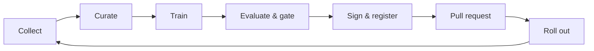
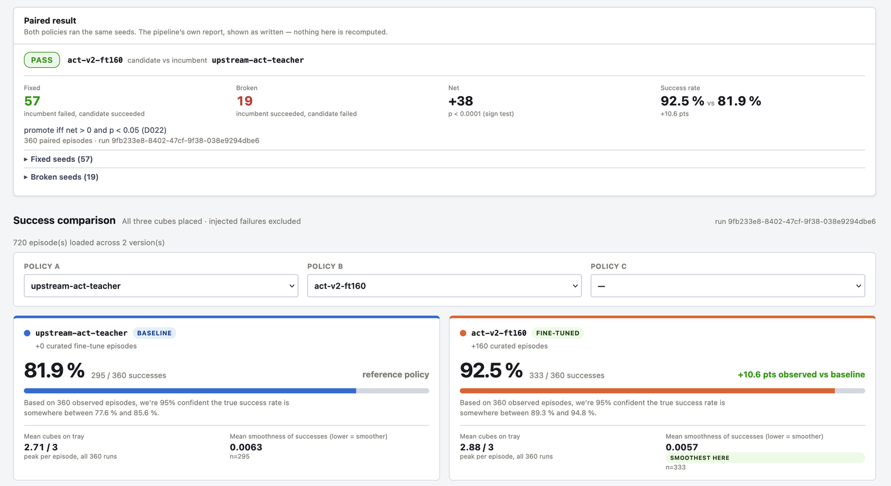
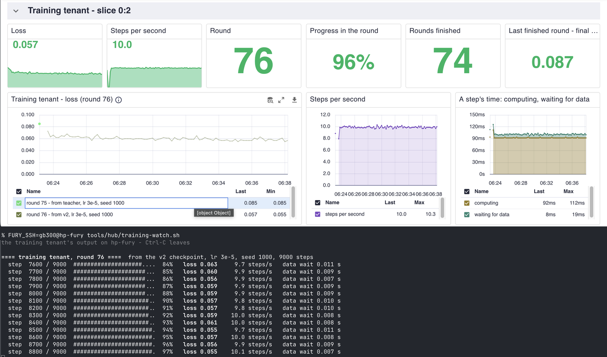
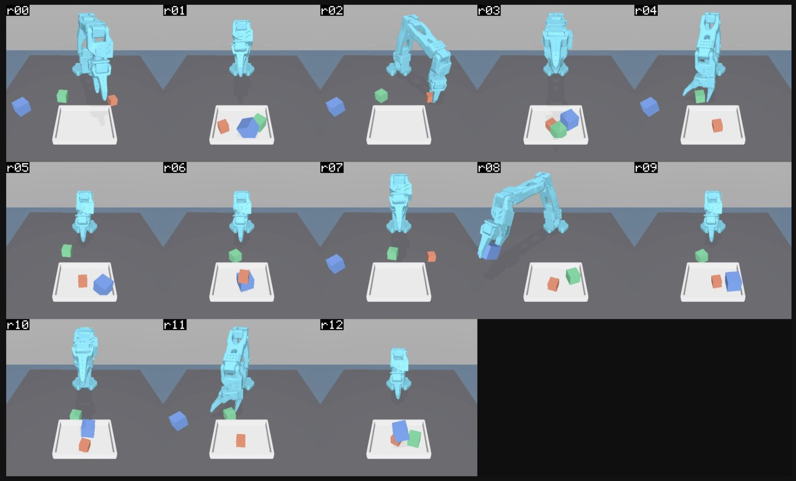
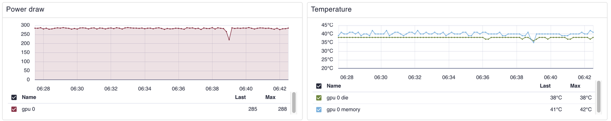

<!-- This project was developed with assistance from AI tools. -->
# Red Hat and HP: Physical AI from Bench to Fleet

> [!NOTE]
> This project was developed with assistance from AI tools.

One HP ZGX Fury workstation carries a physical AI project from the engineer's bench to a managed fleet of robots. On
its single NVIDIA GB300 GPU a coding assistant, a robot's policy, a training job and a ray-tracing renderer run side by
side. On the same machine a Red Hat OpenShift hub gates, signs and promotes the policy, and Red Hat Edge Manager rolls
it out to thirteen devices.

It tells two stories:

- **One GPU, four tenants.** MIG splits the GB300 into four isolated slices, and each slice does a different job for a
  robotics team at the same time: writing code, running a robot, training, and rendering a fleet's cameras.
- **The flywheel.** A robot's policy improves on its own curated episodes, has to beat the policy it would replace on
  paired scenes, ships as a signed image, and reaches the GPU host and twelve robots through one merged pull request.

The arm, its simulation and the policy architecture are upstream work of the
[ROS physical AI community](https://github.com/ros-physical-ai/demos) and
[LeRobot](https://github.com/huggingface/lerobot). This project is the platform around them: GPU tenancy, curation, the
gated pipeline, signing, promotion and fleet delivery.

## One GPU, four tenants

The workstation has one NVIDIA GB300 with 252 GB of HBM3e GPU memory, beside a 72-core NVIDIA Grace CPU and 496 GB of
system memory. MIG splits the GPU into one large slice and three small ones. Each slice has its own compute and its own
memory, and each belongs to one tenant.

| Slice | MIG profile | Tenant | What runs on it |
|---|---|---|---|
| `0:0` | `3g.126gb` - three compute units, 126 GB | [Coding assistant](#coding-assistant) | a Qwen3 coder model served by vLLM |
| `0:1` | `1g.31gb` - one compute unit, 31 GB | [Robot zero](#robot-zero-and-the-flywheel) | the signed policy that drives the first robot, delivered by Edge Manager |
| `0:2` | `1g.31gb` - one compute unit, 31 GB | [Training](#training-tenant) | fine-tunes of the robot's policy, round after round |
| `0:3` | `1g.31gb` - one compute unit, 31 GB | [Rendering](#rendering-tenant-and-the-fleet) | ray tracing of every robot's cameras for the fleet |

*All four slices on one dashboard. Training and rendering each keep their slice about 80% busy while the assistant
holds 113 GiB of model and cache in its own.*

More: [GPU tenants](docs/architecture/gpu-tenants.md).

### Coding assistant

Slice `0:0`, `3g.126gb`. vLLM serves Qwen3-Coder-Next with a 131k-token context and tool calling behind an
OpenAI-compatible API. A Red Hat OpenShift Dev Spaces workspace on the hub opens this repository with a terminal coding
agent pointed at the slice, so the code and the model that reads it stay on the workstation. A single stream decodes
about 245 tokens a second, with the first token after 0.13 s.

### Robot zero and the flywheel

Slice `0:1`, `1g.31gb`. The workstation is also the fleet's first robot. Edge Manager delivers the signed ACT policy to
it as a Fleet application, and a device label places it on this slice. The policy drives an SO-ARM101 arm in closed
loop - camera pictures in, joint commands out - putting three cubes on a tray, episode after episode.

Robot zero is where the flywheel turns. Every episode it finishes goes to a curator, and the policy it runs is the one
the loop last promoted.

1. **Collect and curate.** The curator scores every episode - all three cubes on the tray, smooth motion - and keeps
   the ones that pass. The page counts them toward 160.
2. **Train.** At 160 curated successes a trigger starts the pipeline on Red Hat OpenShift AI, which fine-tunes the
   current policy on them.
3. **Evaluate and gate.** Candidate and incumbent run the same seeded scenes, paired scene by scene. The gate passes
   only a candidate that fixes more scenes than it breaks, with a sign test below 0.05.
4. **Sign and register.** The model becomes an OCI image, signed with cosign, entered in a transparency log and
   recorded in the Model Registry. Every device checks the signature and the log entry before it runs the image.
5. **Promote and roll out.** The pipeline opens a pull request that pins the image's digest for the GPU host and for
   the robots. A person merges it, and Edge Manager does the rest. Rollback is a `git revert`.

The promoted policy took task success from **82% to 92%** on 360 paired scenes: 57 scenes fixed, 19 broken. From the
merge, the GPU host serves the new model in about a minute and a half, and all twelve robots run it in about three and
a half.

More: [flywheel](docs/architecture/flywheel.md), [supply chain](docs/architecture/supply-chain.md),
[promotion](docs/architecture/promotion.md), [data flow](docs/DATA-FLOW.md).

### Training tenant

Slice `0:2`, `1g.31gb`. The GPU's standing training load: fine-tunes of the ACT policy with `lerobot-train`, in rounds
of 9000 steps at about ten steps a second, a round every quarter of an hour. It has run more than seventy rounds back
to back. A Perses dashboard on the hub shows loss, pace and rounds, and `tools/hub/training-watch.sh` follows the same
run from a terminal.

The neighbours do not feel it. The coding assistant decodes 246.6 tokens a second while a round trains on the next
slice, and 245.7 with that slice idle.

### Rendering tenant and the fleet

Slice `0:3`, `1g.31gb`. A MIG slice is compute only, so no simulator draws its own cameras. Every robot's world is
physics only, and this tenant ray-traces the pictures with CUDA (MuJoCo-Warp): two cameras for each of thirteen robots,
480x480 at 15 frames a second, in one batch per tick.

*The fleet wall: robot zero and the twelve robots behind it, every camera ray-traced on one slice.*

The twelve robots are RHEL image mode virtual machines, each a clone of one golden image with its own identity. They
enrol with Red Hat Edge Manager, join a Fleet, and take every new model in batches: a canary, then a quarter of the
Fleet, then half, then the rest. Each robot pulls its images itself and verifies their signatures. Nobody logs in to a
robot. Twelve robots were enrolled and healthy about 25 minutes after the first one booted.

More: [fleet](docs/architecture/fleet.md).

## The box, by the numbers

| HP ZGX Fury | |
|---|---|
| CPU | NVIDIA Grace, 72 Arm Neoverse V2 cores |
| CPU memory | 496 GB LPDDR5x |
| GPU | one NVIDIA GB300 (Blackwell Ultra), 252 GB HBM3e, split by MIG into `3g.126gb` + `1g.31gb` + `1g.31gb` + `1g.31gb` |
| Storage | four embedded M.2 NVMe drives, 12 TB |
| Software | Red Hat Enterprise Linux 10.2, aarch64 |

Everything above runs on it at once:

- **Four GPU tenants** on one GPU, isolated from each other.
- **A Red Hat OpenShift hub** in a virtual machine - 32 vCPUs, 128 GiB - with GitOps, the pipeline, the Model Registry,
  Edge Manager and Dev Spaces.
- **Twelve robots** as virtual machines of 2 vCPUs and 3 GiB each, and **thirteen devices** under Edge Manager.
- **About 245 tokens a second** from the coding assistant, **ten training steps a second**, and **twenty-six cameras
  ray-traced at 15 frames a second**, side by side.
- **About three and a half minutes** from a merged pull request to thirteen devices running the new model.
- **About 285 W** at the GPU with all four tenants busy, at 38 °C.

## Explore

| Document | What is in it |
|---|---|
| [`docs/ARCHITECTURE.md`](docs/ARCHITECTURE.md) | the big picture, then one page per part: [flywheel](docs/architecture/flywheel.md), [GPU tenants](docs/architecture/gpu-tenants.md), [fleet](docs/architecture/fleet.md), [supply chain](docs/architecture/supply-chain.md), [promotion](docs/architecture/promotion.md), [hub](docs/architecture/hub.md) |
| [`docs/FURY-DEMO-LITE.md`](docs/FURY-DEMO-LITE.md) | a browser-only walk through the running system |
| [`docs/FURY-DEMO.md`](docs/FURY-DEMO.md) | the full demo from a laptop: eight beats, resets, recovery |
| [`docs/SETUP.md`](docs/SETUP.md) | bring-up, from a fresh RHEL install to the running system |
| [`docs/DATA-FLOW.md`](docs/DATA-FLOW.md) | an episode's path to a promotion, stage by stage |

## Platform

| Component | Role | Version |
|---|---|---|
| Red Hat Enterprise Linux, RHEL image mode | the GPU host; the robots' operating system | 10.2 |
| Red Hat OpenShift, single node | the hub | 4.22 |
| Red Hat OpenShift GitOps, Red Hat OpenShift Pipelines | delivery from git; image builds and signing | - |
| Red Hat OpenShift AI | the pipeline and the Model Registry | 3.5 |
| Red Hat Edge Manager | Fleets, enrollment, staged rollout | 1.3.0 |
| Red Hat OpenShift Dev Spaces | the coding workspace | 3.30 |
| Red Hat AI Inference Server | serving code assistant | w/vLLM |
| cosign, Rekor transparency log | signatures, verified on every device | cosign 2.6.5 |

The system was developed first on an x86 development stand-in; the same manifests run on the Fury.
