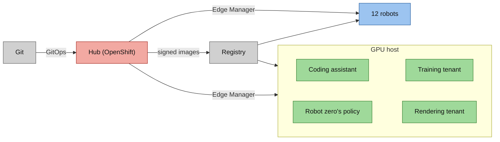
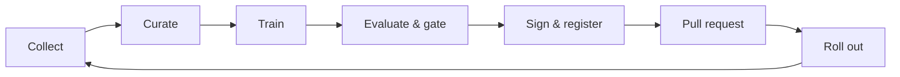

<!-- This project was developed with assistance from AI tools. -->
# Physical AI Edge Flywheel

A robot-learning loop with a platform around it. A learned policy for a robot arm improves on curated episodes, has
to beat the policy it would replace on paired scenes, and ships as a signed image that one merge rolls out to a GPU
host and a fleet of twelve robots. It runs on one HP ZGX Fury workstation: one NVIDIA GB300 GPU split into four
isolated tenants, a Red Hat OpenShift hub, and thirteen devices under Red Hat Edge Manager.

The arm, its simulation and the policy architecture are upstream work of the ROS physical AI community and LeRobot.
This project is what surrounds them: curation, the gated pipeline, signing, promotion, fleet delivery and GPU tenancy.

> [!NOTE]
> This project was developed with assistance from AI tools.

*The fleet wall: thirteen simulated arms, every camera ray-traced on one GPU slice.*

## What it shows

- **A learned policy earns its promotion.** A candidate replaces the incumbent only if it fixes more scenes than it
  breaks on paired, seeded scenes, with a sign test below 0.05.
- **What is promoted is a signed image.** The model is an OCI image, signed and entered in a transparency log. Every
  device checks the signature and the log entry before it runs the image.
- **One merge, thirteen devices, minutes.** A promotion is a pull request. Merging it rolls the model to the GPU host
  and through twelve robots in batches. Rollback is a `git revert`.
- **One GPU, four isolated workloads.** MIG splits the GB300 into four slices. A coding assistant, a robot's policy, a
  training job and a ray-tracing renderer run side by side, isolated from each other.
- **Everything is delivered from git.** Argo CD delivers the hub, Edge Manager delivers the devices, and nobody logs
  in to a robot.

## The system at a glance

The hub runs GitOps, the pipeline and Edge Manager. Edge Manager manages thirteen devices: the GPU host, which is also
robot zero, and twelve RHEL image mode robots. The hub and the robots are virtual machines on the same workstation
([architecture](docs/ARCHITECTURE.md)).

## How it works

1. **Collect and curate.** A robot runs the current policy. A curator scores every episode - all three cubes on the
   tray, smooth motion - and keeps the ones that pass.
2. **Train.** At 160 new curated successes a trigger starts the pipeline, which fine-tunes the current policy on them.
3. **Evaluate and gate.** Candidate and incumbent run the same seeded scenes, paired scene by scene. The gate passes
   only a candidate that fixes more than it breaks.
4. **Sign and register.** The model becomes an OCI image, signed with cosign, entered in a transparency log and
   recorded in the Model Registry.
5. **Promote and roll out.** The pipeline opens a pull request that pins the image's digest in both Fleets. A person
   merges it, and Edge Manager does the rest.

## By the numbers

- **82% to 92%** task success on 360 paired scenes: 57 scenes fixed, 19 broken, and the gate promoted the policy.
- **About a minute and a half** from merge to the GPU host serving the promoted model; **about three and a half
  minutes** until all twelve robots run it.
- **246.6 against 245.7 tokens a second**: the coding assistant's throughput with and without a training job on the
  neighbouring slice.
- **Thirteen robots' cameras at 15 frames a second**, two cameras each, ray-traced on one GPU slice.
- **Twelve robots enrolled and healthy in about 25 minutes**, each a clone of one golden image with its own identity.

## Explore

| Document | What is in it |
|---|---|
| [`docs/ARCHITECTURE.md`](docs/ARCHITECTURE.md) | the big picture, then one page per part: [flywheel](docs/architecture/flywheel.md), [GPU tenants](docs/architecture/gpu-tenants.md), [fleet](docs/architecture/fleet.md), [supply chain](docs/architecture/supply-chain.md), [promotion](docs/architecture/promotion.md), [hub](docs/architecture/hub.md) |
| [`docs/FURY-DEMO-LITE.md`](docs/FURY-DEMO-LITE.md) | a browser-only walk through the running system |
| [`docs/FURY-DEMO.md`](docs/FURY-DEMO.md) | the full demo from a laptop: eight beats, resets, recovery |
| [`docs/SETUP.md`](docs/SETUP.md) | bring-up, from a fresh RHEL install to the running system |
| [`docs/DATA-FLOW.md`](docs/DATA-FLOW.md) | an episode's path to a promotion, stage by stage |

## Repository layout

| Path | Contents |
|---|---|
| `argocd/` | the Argo CD Applications that bootstrap the hub |
| `gitops/` | what the hub runs, one directory per application; the two Edge Manager Fleets in `gitops/rhem/` |
| `pipeline/` | the OpenShift AI pipeline: gate, package, sign, register, pull request |
| `src/` | the services: episode loop, evaluation pages, fleet worlds, renderer, robot zero, tenant metrics, workspace |
| `tools/hub/` | laptop-side scripts: image builds, fleet approval and status, promotion reset |
| `tools/host/fury/` | the scripts and units that prepared and operate the GPU host, written for that one machine |
| `tests/` | pytest suites, by component |

## Platform

| Component | Role | Version |
|---|---|---|
| HP ZGX Fury: NVIDIA GB300, 72-core Grace, aarch64 | the workstation | - |
| Red Hat Enterprise Linux, RHEL image mode | the GPU host; the robots' operating system | 10.2 |
| Red Hat OpenShift, single node | the hub | 4.22 |
| Red Hat OpenShift GitOps, Red Hat OpenShift Pipelines | delivery from git; image builds and signing | - |
| Red Hat OpenShift AI | the pipeline and the Model Registry | 3.5 |
| Red Hat Edge Manager | Fleets, enrolment, staged rollout | 1.3.0 |
| Red Hat OpenShift Dev Spaces | the coding workspace | 3.30 |
| cosign, Rekor transparency log | signatures, verified on every device | cosign 2.6.5 |

## Built on

- [`ros-physical-ai/demos`](https://github.com/ros-physical-ai/demos) - the SO-ARM101 arm, its Gazebo simulation, the
  LeRobot ACT policy and the Rosetta ROS 2 to LeRobot bridge
- [LeRobot](https://github.com/huggingface/lerobot) - policy training and the dataset format
- ROS 2 with the `rmw_zenoh` middleware
- [MuJoCo-Warp](https://github.com/google-deepmind/mujoco_warp) - batched ray tracing of the fleet's cameras
- [vLLM](https://github.com/vllm-project/vllm) - serving the coding model
- [Flight Control](https://github.com/flightctl/flightctl) - the upstream of Red Hat Edge Manager, and the device agent
- [sigstore](https://github.com/sigstore) - cosign and Rekor

The system was developed first on an x86 development stand-in; the same manifests run on the Fury.
