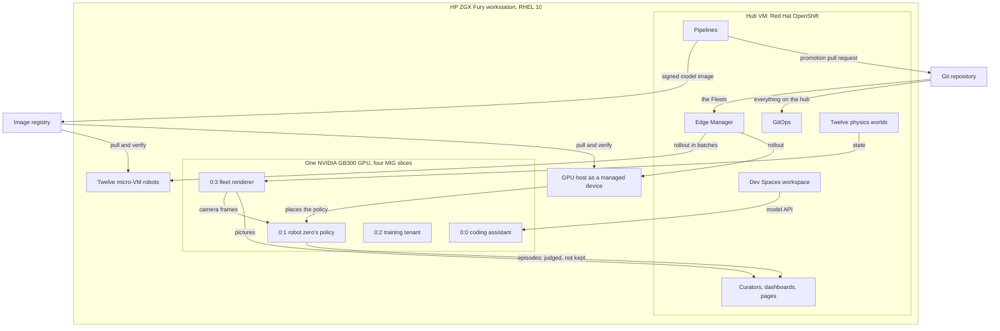

<!-- This project was developed with assistance from AI tools. -->
# Physical AI Edge Flywheel

A governed robot-learning loop: successful episodes become data, a candidate policy must beat the
incumbent on paired scenes, and what passes is signed, registered, promoted by pull request and
rolled out to devices that verify it before they run it. It runs on one HP ZGX Fury workstation: one
NVIDIA GB300 GPU split into four isolated tenants, a Red Hat OpenShift hub in a VM on the same
machine, and twelve RHEL image mode micro-VM robots plus the GPU host itself under Red Hat Edge
Manager. The robot arm, its simulation and the policy architecture are upstream work of the ROS
physical AI community and LeRobot; this project is what surrounds them - curation, the gated
pipeline, signing and promotion, fleet delivery, the GPU tenancy, and the GitOps that delivers it all.

> [!NOTE]
> This project was developed with assistance from AI tools.

## One machine

## Two stories, one running system

The system stays in this state all day. Nothing is switched on to show it; pieces are shown and reset
one by one.

### The flywheel

1. **Collect.** Robot zero - the GPU host as a robot - runs the signed policy that Edge Manager
   delivered, on its own GPU slice, closed loop on ray-traced cameras. Every episode is judged as it
   ends by the curator's real gates: did the three cubes land on the tray, was the motion smooth. This
   is the *live lane*: judged, not kept. No recording is made, and nothing seen live becomes training
   data. At 160 passes the page says "this is where a governed training run would start", and the
   count begins again.
2. **Train.** The training tenant runs real ACT fine-tunes, round after round, on a small slice while
   three other tenants work beside it. Nothing from these rounds is evaluated, signed or promoted.
3. **Evaluate and gate.** A candidate is promoted only if it fixes more scenes than it breaks against
   the incumbent, with a paired sign test below 0.05. The governed run's paired evaluation: 360
   identical seeded scenes, 295 successes became 333 (**82% to 92%**), 57 fixed / 19 broken, gate
   **PASS**. The evidence is the evaluation page, pinned to that run.
4. **Promote.** The pipeline packaged the model as an OCI image, signed it into a transparency log,
   registered it in the Model Registry and opened a pull request that pins the image's digest and the
   version in both Fleets. One merge rolls the signed model to the GPU host on its slice and through
   the twelve robots in batches (canary, 25%, 50%, the rest). Rollback is a `git revert`.

| Step | In the running system | Live? |
|---|---|---|
| Collect | robot zero's episodes, judged by the curator's gates and not kept | live |
| Train | the training tenant's rounds; nothing from them is promoted | live |
| Evaluate and gate | the governed run's paired evaluation on the evaluation page; an evaluation takes hours | recorded results in a live page |
| Promote | a pull request that re-shows the recorded promotion - same signed image, same gate record, nothing re-measured - then the merge and the rollout to 13 devices | live |

What is shown is the system that produced that promotion, still running. It is not a claim that what
is on screen trained the promoted model.

### One GPU, four tenants, a managed fleet

| Slice | Tenant | Delivered by | Seen as |
|---|---|---|---|
| `0:0` (3g) | coding assistant: a Qwen coder model served by vLLM | a unit on the host | a Dev Spaces workspace whose coding agent uses it |
| `0:1` (1g) | robot zero: the signed ACT policy | Edge Manager; placed on this slice by a device label | the flywheel page's cameras; `r00` on the fleet wall |
| `0:2` (1g) | training tenant: ACT fine-tunes in rounds | a unit on the host | a loss curve; a terminal view |
| `0:3` (1g) | fleet rendering tenant: ray-traces every robot's cameras with CUDA | a unit on the host | the fleet wall |

**Isolation.** MIG gives each slice its own compute and memory: the coding assistant's throughput does
not move when the training tenant runs next door (numbers below). The GPU tenants dashboard names
every slice by its tenant and shows each tenant's own headline number beside the GPU's.

**The fleet wall.** Each of the twelve robots is a RHEL image mode micro-VM, a copy-on-write clone of
one golden image. It enrolled itself, was approved, and pulls and verifies its own signed images. The
robots' physics worlds run as pods on the hub and send arm and cube state to the rendering tenant,
which ray-traces thirteen robots' cameras on one small slice. On the wall the twelve arms replay
recorded episodes of the policy's actions; only robot zero (`r00`) is closed loop.

## Measured on this machine

| What | Measured |
|---|---|
| Merge to the GPU host serving the promoted model | 1 min 38 s the first time; 1 min 32 s re-shown, with the policy on its MIG slice |
| Merge to the whole fleet | all twelve robots updated after 3 min 23 s; all 13 devices healthy at 3 min 39 s |
| Reset between showings | the host back on the previous model about 50 s after the push; all 13 devices healthy in about 5 min |
| Coding assistant on its 3g slice | about 245 tokens a second, single stream; first token in about 0.13 s; ready in under 3 min after a start |
| Isolation | 246.6 tokens a second with the training tenant running next door, 245.7 without |
| Training tenant on a 1g slice | about 10 steps a second; a round is 9000 steps, about a quarter of an hour |
| Rendering tenant on a 1g slice | about 228 camera pairs a second; 13 robots at 15 frames a second, 480x480, two cameras each; geometry matches the simulator's cameras to 0.09 px |
| Fleet bring-up | golden OS image built in 34 s, its disk in 65 s, under 1 GB; twelve robots enrolled, approved and healthy about 25 min after the first one booted; 12 distinct host keys, device identities and hardware ids |
| Robot zero on ray-traced cameras, closed loop, no tuning | the first full episode placed all three cubes in 59 s |

## What is in the repository

| Path | Contents |
|---|---|
| `argocd/` | the Argo CD Applications that bootstrap the hub, and their order |
| `gitops/operators/`, `gitops/operators-config/` | OpenShift AI and OpenShift Pipelines subscriptions; the pipelines server, Model Registry |
| `gitops/storage/`, `gitops/minio/` | the node-local storage class; object storage and its read-only user |
| `gitops/flywheel/` | curators (governed lane and live lane), sync agent, Kafka, the training trigger, the flywheel page, the evaluation pages, the Services and Routes in front of the host's tenants |
| `gitops/fleet-worlds/` | the robots' physics-only worlds, one pod per robot |
| `gitops/rhem/`, `gitops/rhem-catalog/` | the two Edge Manager Fleets and the model catalog item - synced by Edge Manager, not by Argo CD |
| `gitops/observability/` | Prometheus, the scrapes of the GPU host, the GPU tenants dashboard |
| `gitops/devspaces/`, `gitops/tekton/` | the Dev Spaces instance; the image build-and-sign pipeline |
| `rhem/bootstrap/` | the one-time Edge Manager objects: `Repository`, two `ResourceSync`s, `Catalog` |
| `pipeline/` | the OpenShift AI pipeline: training and paired evaluation (handed to the training runner), gate, package, sign, register, pull request |
| `src/` | `inference-coordinator`, `episode-emitter`, `sim-reset`, `camera-bridge`, `pose-ui` (the episode loop); `dataset-assembler`, `host-runner`, `eval-report` (training and evaluation); `eval-dashboard`; `fleet-world`, `fleet-renderer`, `robot-zero`, `tenant-metrics` (fleet and tenants); `dev-workspace` |
| `docker/` | the simulation image, the multi-arch inference runtime image, the renderer image |
| `device/` | provisioning and enrolment of a RHEL device |
| `tools/hub/` | laptop-side scripts: image builds, fleet approval and status, promotion reset and re-open, robot zero, the training view |
| `tools/host/fury/` | the scripts and units that prepared and operate the GPU host: MIG, network, hub VM, tenants, golden image, fleet scaling |
| `tests/` | pytest suites by component: `eval_dashboard`, `fleet_renderer`, `fleet_world`, `host_runner`, `hub`, `pipeline`, `robot_zero`, `tenant_metrics` |
| `docs/` | architecture, data flow, setup and the demo runbooks |

## See it, run it

| Document | For |
|---|---|
| [`docs/FURY-DEMO-LITE.md`](docs/FURY-DEMO-LITE.md) | a browser-only walk-through of the running system, for a presenter who did not build it |
| [`docs/FURY-DEMO.md`](docs/FURY-DEMO.md) | the full demo from your own laptop: prerequisites, eight beats, resets, what to do when something goes wrong |
| [`docs/SETUP.md`](docs/SETUP.md) | bring-up: the host, the hub, the tenants and the fleet |
| [`docs/NETWORK-ACCESS.md`](docs/NETWORK-ACCESS.md) | how the machine is reached, and what it needs to reach |
| [`docs/ARCHITECTURE.md`](docs/ARCHITECTURE.md) | the machine, the hub, the tenants, the fleet, the supply chain, networks and ports |
| [`docs/DATA-FLOW.md`](docs/DATA-FLOW.md) | an episode's path to a promotion, stage by stage |

Scope, honestly: the scripts under `tools/host/fury/` prepared and operate one particular machine.
They change the host they run on and their checks were written for that host; they are the record of
what was done, not an installer for anything else. The manifests under `gitops/` are general.

## Platform

| Component | Role | Version |
|---|---|---|
| HP ZGX Fury: NVIDIA GB300, 72-core Grace, aarch64 | the one machine | - |
| Red Hat Enterprise Linux | the GPU host | 10.2 |
| RHEL image mode (bootc) | the robots' operating system image | 10.2 |
| Red Hat OpenShift, single node, in a VM | the hub | 4.22 |
| Red Hat OpenShift GitOps (Argo CD) | delivers everything on the hub from git | - |
| Red Hat OpenShift AI | the pipeline (Data Science Pipelines) and the Model Registry | 3.5 |
| Red Hat OpenShift Pipelines (Tekton) | builds and signs images on the hub | - |
| Red Hat Edge Manager | Fleets, enrolment, staged rollout to 13 devices | 1.3.0, chart `redhat-rhem` |
| Red Hat OpenShift Dev Spaces | the coding workspace | 3.30 |
| Cluster Observability Operator | Prometheus and the Perses dashboard | - |
| cosign and a Rekor transparency log | signatures, verified on every device | cosign v2.6.5; Rekor on Trillian, built for arm64 from the public source of Red Hat Trusted Artifact Signer 1.4.3 |
| Object storage, Kafka | episodes, evaluation records, manifests, triggers | - |
| NVIDIA MIG, DCGM exporter | GPU partitioning and telemetry | - |

This is what runs on this aarch64 machine. It is not a statement of support for any configuration.

## Built on

- [`ros-physical-ai/demos`](https://github.com/ros-physical-ai/demos) - the SO-ARM101 arm, its Gazebo
  simulation, the LeRobot ACT policy and the Rosetta ROS 2 to LeRobot bridge
- [LeRobot](https://github.com/huggingface/lerobot) - policy training and the dataset format
- ROS 2 with the `rmw_zenoh` middleware
- [MuJoCo-Warp](https://github.com/google-deepmind/mujoco_warp) - batched ray tracing of the fleet's cameras
- [vLLM](https://github.com/vllm-project/vllm) - serving the coding model
- [Flight Control](https://github.com/flightctl/flightctl) - the upstream of Red Hat Edge Manager, and the device agent
- [sigstore](https://github.com/sigstore) - cosign and Rekor
- HP ZGX Fury (NVIDIA GB300, Grace Blackwell, aarch64)

The system was developed first on an x86 development stand-in; the same manifests run on the Fury.
