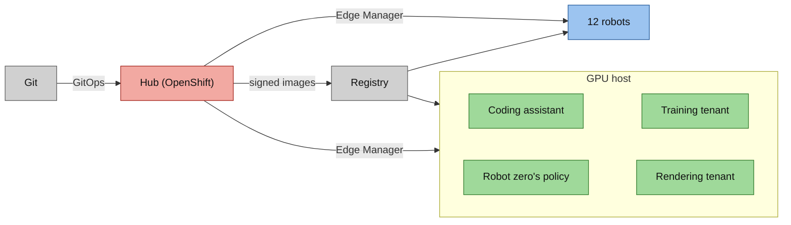

<!-- This project was developed with assistance from AI tools. -->
# Architecture

One workstation carries the whole system: a GPU host whose one GPU is split into four tenants, an OpenShift hub, and
twelve robots. Git says what runs everywhere, and a registry holds the signed images the devices pull. This page is the
big picture. Each part has its own page, listed under [Go deeper](#go-deeper).

The colours mean the same thing in every diagram of these pages:

| Colour | Meaning |
|---|---|
| green | runs on a slice of the GPU |
| red | runs on the hub |
| blue | a managed device, or a part of one that needs no GPU |
| grey | outside the workstation |
| amber | a page you can open in a browser |

## The workstation

An HP ZGX Fury: a 72-core Grace CPU and one NVIDIA GB300 GPU, aarch64, running RHEL 10.2. The hub and the twelve robots
are KVM virtual machines on it, on one routed network (`10.20.0.0/24`): the host is `10.20.0.1`, the hub `10.20.0.10`,
robot `NN` is `10.20.0.(20+NN)`. The host's own DNS server answers the cluster's names.

## GPU host

MIG splits the GB300 into one large slice and three small ones, and each slice has one tenant: a coding assistant, robot
zero's policy, a training tenant and the fleet's rendering tenant. Three of them are podman units on the host. The
fourth, robot zero's policy, is delivered by Edge Manager, because the GPU host is itself an enrolled device: robot
zero, the fleet's first robot. A MIG slice computes but has no graphics, so every camera in the system is ray-traced
with CUDA by the rendering tenant. Details: [GPU tenants](architecture/gpu-tenants.md).

## Hub

Single-node Red Hat OpenShift 4.22 in a virtual machine: 32 vCPUs, 128 GiB. Argo CD delivers everything on it from
`gitops/`, one Application per directory. It runs OpenShift AI (the promotion pipeline and the Model Registry),
OpenShift Pipelines (image builds and signing), a transparency log, Red Hat Edge Manager, Dev Spaces, the curators and
their pages, Kafka, object storage, Prometheus and the GPU tenants dashboard. It also runs the twelve robots' physics
worlds, one pod per robot. Details: [hub](architecture/hub.md).

## 12 robots

Each robot is a RHEL image mode micro-VM: a copy-on-write clone of one golden image, with two vCPUs and its own
identity. A robot enrols itself in Edge Manager, is approved with labels, joins Fleet `robots`, then pulls, verifies
and runs the same signed policy the GPU host runs, on CPU. A model rollout walks the Fleet in batches: a canary first,
then up to a quarter of the Fleet, then up to half, then the rest. Details: [fleet](architecture/fleet.md).

## Git and the registry

Git holds the manifests of everything above, including the two Fleets, so a change to what any device runs is a
commit. A promotion is a pull request that changes one image digest and one version in both Fleet files. The registry
holds the images: every image the project builds is signed on the hub and entered in its transparency log, and each
device checks both before it runs the image. Details: [supply chain](architecture/supply-chain.md),
[promotion](architecture/promotion.md).

## Go deeper

| Page | What it explains |
|---|---|
| [Flywheel](architecture/flywheel.md) | the loop from an episode to a promoted policy: the curators, the pipeline's stages, the gate |
| [GPU tenants](architecture/gpu-tenants.md) | MIG, the four tenants, how each is delivered and observed, isolation |
| [Fleet](architecture/fleet.md) | image mode robots, enrolment and approval, batches, the worlds, the fleet wall, robot zero |
| [Supply chain](architecture/supply-chain.md) | build, sign, transparency log, verification on the device |
| [Promotion](architecture/promotion.md) | the pull request across both Fleets, the rollout and its timings, rollback, showing it again |
| [Hub](architecture/hub.md) | what runs on the hub, GitOps application by application, networks and ports |

Related: [`DATA-FLOW.md`](DATA-FLOW.md) walks one episode to a promotion, stage by stage.
[`BILL-OF-MATERIALS.md`](BILL-OF-MATERIALS.md) lists every component and image. [`SETUP.md`](SETUP.md) is the bring-up.
