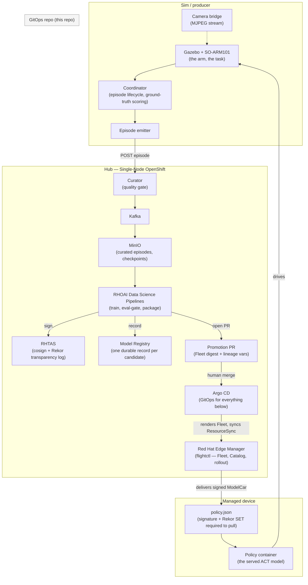

# Architecture

Three logical planes — a **hub**, a **managed device**, and a **sim/producer** — connected by a
governed promotion path. On the development stand-in these run across two physical machines; on
the target hardware (the HP ZGX Fury) they collapse onto one. See the topology section below and
[`docs/FURY-SETUP.md`](FURY-SETUP.md) for what changes between the two.

## Component diagram

The loop closes at the bottom: the device's served policy drives the arm in the sim again, its
rollouts flow back through the curator, and — once enough new curated successes accumulate — the
pipeline fires again on its own.

## The hub plane (Single-Node OpenShift)

Everything the hub runs is delivered by Argo CD from `gitops/` in this repo — see
[`argocd/README.md`](../argocd/README.md) for the exact bootstrap order and
[`docs/BILL-OF-MATERIALS.md`](BILL-OF-MATERIALS.md) for every component.

- **Argo CD** (OpenShift GitOps) — every other hub component is one of its Applications, each
  pruning to exactly what's in `gitops/<dir>`.
- **Data plane** — Kafka and MinIO carry episode manifests and curated data between the curator
  and the training pipeline.
- **Curator + sync-agent** — the quality gate. An episode passes only on real, ground-truth task
  success (cube poses read from the simulator's own world state, not a vision heuristic); failures
  keep their metadata but lose their recorded frames.
- **Red Hat OpenShift AI (RHOAI) Data Science Pipelines** — runs the governed promotion pipeline:
  assemble the curated dataset → fine-tune the incumbent policy on it → evaluate candidate vs.
  incumbent on an identical, fixed, seeded scene set (paired, sign-test gated — see
  [`docs/DATA-FLOW.md`](DATA-FLOW.md)) → package as a signed OCI "ModelCar" → open a promotion PR.
  Defined in [`pipeline/act_flywheel_pipeline.py`](../pipeline/act_flywheel_pipeline.py).
- **Red Hat Trusted Artifact Signer (RHTAS)** — cosign signing plus a Rekor transparency log. Every
  promoted image is signed and logged; the device refuses to pull anything that isn't.
- **Model Registry** — one durable record per promoted candidate (digest, dataset URI, paired-eval
  metrics, Rekor index, PR URL), independent of git history or the PR body.
- **Red Hat Edge Manager (RHEM / flightctl)** — the fleet management plane. A `Fleet` object
  (`gitops/rhem/fleet-act-inference.yaml`) describes the managed device's desired application,
  trust configuration, and per-site labels; a `Catalog`/`CatalogItem` tracks the version graph of
  promoted models alongside it. Neither is a Kubernetes CRD Argo can apply directly — they're
  flightctl API objects, rendered from git via a `Repository` + `ResourceSync`
  (`rhem/bootstrap/`), the same pattern Argo itself uses for everything else.

## The managed device

The device runs **only the policy role** — the runtime image, the served model (delivered as a
signed OCI image volume with `reclaimPolicy: Retain`, so a rollback never re-pulls), a lineage
label, and a health check. It does not run the simulator, the coordinator, or the episode recorder
— those stay on the sim/producer side and reach the device only through the promotion pipeline.
Trust enforcement is on the device itself, not just
at the registry: `policy.json` requires both a valid signature and a valid Rekor transparency-log
entry before podman will pull an image — proven by two standing negative tests (an unsigned image,
and a signed-but-unlogged image; both are rejected with a distinct error).

On the desktop stand-in, the device is a small RHEL 10 VM serving the policy on CPU. On the Fury,
the device *is* the physical host, serving on the GPU. Same Fleet, same trust chain, same
promotion path — the only difference is what the per-device labels resolve to. See
[`docs/FURY-SETUP.md`](FURY-SETUP.md) for the full comparison.

## The sim / producer

Gazebo runs the SO-ARM101 arm on the upstream ROS 2 stack (`github.com/ros-physical-ai/demos`). A
coordinator node drives each episode's lifecycle (reset → policy window → cancel → score), scores
task success from the simulator's own ground-truth cube poses, and records each rollout. An
episode emitter packages the result and hands it to the curator. None of this runs on the managed
device — it runs alongside the simulator, on the box hosting the sim.

## Topology: development stand-in vs. the Fury

| | Development stand-in | Fury |
|---|---|---|
| Hub | SNO in a KVM VM | SNO 4.19+ in a VM on the Fury |
| Managed device | separate RHEL 10 KVM VM, CPU-served | the Fury host itself, GPU-served |
| Sim + coordinator | host GPU box (Docker) | Fury host (podman) |
| Runtime image | same multi-arch digest, amd64 platform resolves | same digest, arm64 platform resolves |

The promotion path — pipeline, signing, GitOps, Fleet rollout — is identical on both. Multi-arch
container builds (via OpenShift Pipelines / Tekton) exist specifically so the same signed digest
serves both boxes without a separate build.
