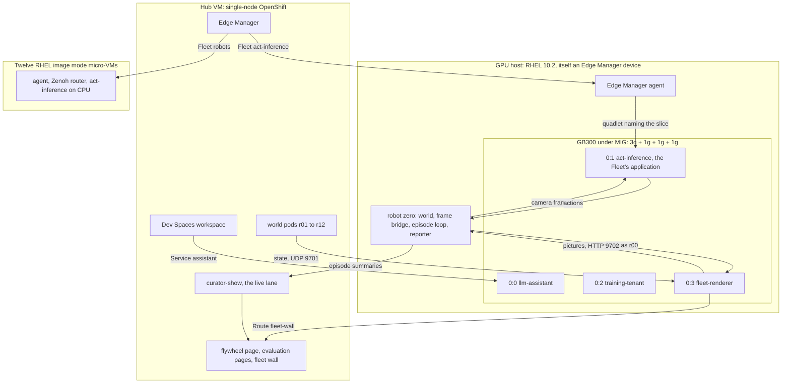
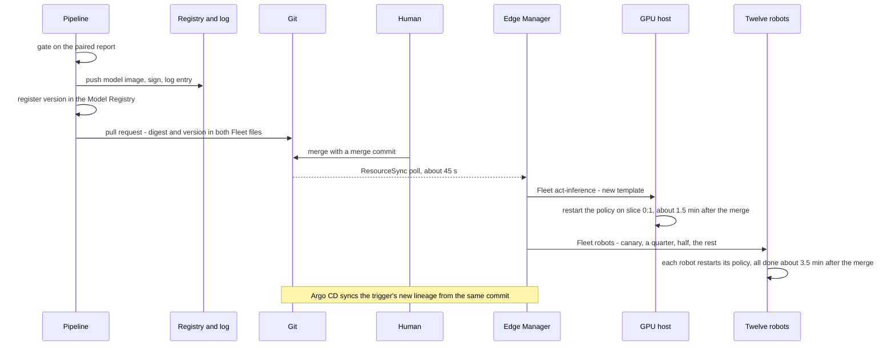

<!-- This project was developed with assistance from AI tools. -->
# Architecture

One workstation carries everything: a GPU split into four tenants, an OpenShift hub in a VM, and thirteen devices under
Red Hat Edge Manager - the GPU host itself and twelve micro-VM robots. This page describes the system as it runs. An
episode's path to a promotion, stage by stage, is in [`DATA-FLOW.md`](DATA-FLOW.md).

Git, the registry and the pipeline are in the promotion sequence further down.

## The machine

An HP ZGX Fury (NVIDIA DGX Station GB300 chassis): a 72-core Grace CPU, one GB300 GPU, aarch64, RHEL 10.2 on a
64 KiB-page kernel. `tools/host/fury/` holds the scripts that prepared it; they are specific to this one machine.

**MIG layout.** `3g.126gb` + `1g.31gb` + `1g.31gb` + `1g.31gb` (profile ids `9,19,19,19`), addressed as CDI devices
`nvidia.com/gpu=0:0` to `0:3`. Neither MIG mode nor the instances survive a reboot on this GPU, so `mig-config.service`
re-creates the layout at boot. It is made by one command in one order, so the GPU instance ids (1, 11, 12, 13) and the
MIG UUIDs repeat; the dashboard's slice names and robot zero's placement rely on that.

**MIG means no graphics on a slice.** A slice is compute only: OpenGL exists only with MIG off, so a simulator cannot
render its own cameras on a slice. Two things follow. Every world in the running system is *physics only*
(`SIM_CAMERAS=off`), and cameras are ray-traced with CUDA by the rendering tenant from the state the worlds send it.
And the host has two modes (`tools/host/fury/fury-mode.sh`): `tenants`, the running state described here, and
`flywheel`, which turns MIG off so the simulator renders its own cameras. That simulator and the episode recorder carry
a start condition (MIG off) and stay down in tenants mode. Changing mode needs an idle GPU, so a switch stops every
tenant first; the demo never switches.

**Host network.** A routed libvirt network, `fury-net` (`10.20.0.0/24`), without DHCP or libvirt DNS: the host is
`10.20.0.1`, the hub `10.20.0.10`, robot `fleet-vm-NN` is `10.20.0.(20+NN)`; the host's dnsmasq answers the cluster's
names. firewalld's `libvirt-to-host` policy rejects every connection from a guest to the host that it does not list.
Operators come in over a tailnet route ([`NETWORK-ACCESS.md`](NETWORK-ACCESS.md)); the lab uplink has no route here.

## The hub

Single-node OpenShift 4.22 in a KVM guest on the same machine: 32 vCPUs, 128 GiB, UEFI, no memory balloon.

**GitOps, app by app.** Each `argocd/*-app.yaml` is applied once by hand; after that Argo CD keeps the cluster equal to
the directory, with prune and self-heal ([`argocd/README.md`](../argocd/README.md)).

| Argo CD app | Source | What it delivers |
|---|---|---|
| `storage` | `gitops/storage/` | the node-local storage class |
| `operators` | `gitops/operators/` | OpenShift AI (channel `stable-3.5`) and OpenShift Pipelines |
| `operators-config` | `gitops/operators-config/` | the `DataScienceCluster`, the pipelines server, the Model Registry |
| `minio` | `gitops/minio/` | object storage, and a read-only user for the evaluation pages |
| `flywheel` | `gitops/flywheel/` | both curators, sync agent, Kafka, the training trigger, the flywheel page, three evaluation pages, Services and Routes in front of the host's tenants |
| `fleet-worlds` | `gitops/fleet-worlds/` | StatefulSet `world` in namespace `fleet`: the robots' physics worlds |
| `observability` | `gitops/observability/` | a Prometheus of its own, three scrapes of the GPU host, Perses and the GPU tenants dashboard |
| `rhem` | Helm chart `redhat-rhem` 1.3.0 | Red Hat Edge Manager |
| `tekton` | `gitops/tekton/` | the image build-and-sign pipeline |
| `devspaces` | `gitops/devspaces/` | the Dev Spaces instance |

Outside Argo CD, on purpose: four operator subscriptions applied first (`argocd/bootstrap-operators.yaml`); hand-created
Secrets, never in git; three EndpointSlices (`tools/hub/manual/`), which Argo CD does not manage; the Fleets, which Edge
Manager syncs itself; and the transparency log - Rekor on Trillian, built for arm64 from the public source of Red Hat
Trusted Artifact Signer 1.4.3 (`tools/host/fury/rhtas-arm64/`), not the product's build.

**The promotion pipeline** (`pipeline/act_flywheel_pipeline.py`, OpenShift AI Data Science Pipelines). A trigger
(`gitops/flywheel/manifest-consumer.yaml`) counts curated successes of the serving lineage on Kafka and starts a run at
160. A human merge is the last gate; nothing merges itself.

| Stage | What it does |
|---|---|
| `trigger_and_wait` | hands training and the paired evaluation to the training runner (`src/host-runner`) over Kafka and waits for its artifacts in object storage: a checkpoint, two evaluation records, the paired report |
| `eval_gate` | passes only if net fixed scenes is above zero and the paired sign test is below 0.05; otherwise the run fails and nothing downstream runs |
| `package_modelcar` | a weights-only OCI image for `linux/amd64` and `linux/arm64` under one index; every image of a run keeps a tag no later run moves |
| `sign_modelcar` | cosign with the hub's key, an entry in the transparency log, then verification; an unlogged signature stops the run |
| `register_model` | one Model Registry version per candidate: digest, dataset URI, paired metrics, log index |
| `open_promotion_pr` | one commit: the model image's digest and `MODEL_VERSION` in **both** Fleet files, the trigger's lineage, the catalog item; it refuses if the Fleet files do not pin the same model beforehand |
| `record_pr_url` | writes the pull request's address into the registry version |

**The curators: two lanes, one code.** Both run ConfigMap `curator-code` at the same revision. The gates judge physics -
completeness, cubes on the tray, smoothness - not pixels.

- *The governed lane* (`curator`, NodePort 30802): passed episodes go through the sync agent to object storage and a
  Kafka manifest, and count towards the trigger. Its producer is the flywheel-mode loop; in tenants mode nothing feeds it.
- *The live lane* (`curator-show`, NodePort 30812) judges robot zero's episodes so the flywheel page tells the story
  live. "Judged, not kept" is structural, not a flag on the governed lane: its own small volume instead of the node's
  episode directory; its own service account with no host-mount grant, under `restricted-v2`; no object-storage or
  Kafka variable, no credential, no token; a NetworkPolicy with no egress, and ingress from the GPU host's address
  only. It keeps the newest 300 records of each verdict and a totals file, so the page has a log. No sync agent, mirror
  or trigger reads that volume. On both lanes a body is bounded and validated, and the pages escape what they show.

**Pages.** The flywheel page (`dashboard`): on the live lane, robot zero's cameras, the latest verdict and a counter to
160. Three instances of one signed image (`src/eval-dashboard`), pinned by one digest: *Paired evaluation*, pinned to
the governed run by `EVAL_RUN_ID` and read through a read-only object-storage user; *Live episodes (collection)*, the
governed lane's record; *Live episodes - live lane*, which mounts only the live lane's verdict directories, read-only.
The fleet wall is a Route in front of the renderer; the GPU tenants dashboard is Perses.

**Edge Manager** manages two Fleets from git. Fleets are Edge Manager API objects, not Kubernetes resources, so a
`Repository` and two `ResourceSync`s (`rhem/bootstrap/`) render `gitops/rhem/` and `gitops/rhem-catalog/`. Its chart
declares x86_64; on this aarch64 hub the product's images run. That says what runs, not what is supported.

## The four tenants

`fury-mode tenants` starts the three host-unit tenants and robot zero's host side once the slices exist; every mode
switch stops them first; a boot in tenants mode brings them back. A GPU unit does not start when its CDI device is absent.

### Coding assistant - slice `0:0` (3g)

A Qwen coder model (`qwen3-coder-next`) served by vLLM with tool calling and a 131k context. **Delivered as** a host
quadlet, `llm-assistant.container`, owned by `fury-mode`; image pinned by digest, model read offline from local storage.
**Listens on** `10.20.0.1:8000`: an OpenAI-compatible API, and `/metrics`. In the cluster it is Service
`assistant.flywheel.svc:8000`, no selector, a hand-applied EndpointSlice - and **no Route**: the API has no key, so its
clients are pods only, in practice a Dev Spaces workspace (`devfile.yaml`, `src/dev-workspace`) whose terminal coding
agent may edit files and run tests and has no web access. **Observed by** a scrape of vLLM's metrics, kept to four series.

### Robot zero's policy - slice `0:1` (1g)

The one GPU tenant that is not a host unit: the `act-inference` application of Fleet `act-inference`, delivered,
verified and started by the Edge Manager agent (next section). **Observed by** the DCGM exporter and the live lane's pages.

### Training tenant - slice `0:2` (1g)

Real ACT fine-tunes (`lerobot-train` in the signed runtime image): a fixed list of eight configurations - start
checkpoint, learning rate, seed - 9000 steps a round, over and over. **Delivered as** `training-tenant.container`, owned
by `fury-mode`. **Listens on** nothing: `Network=none`, no credentials, its dataset and start checkpoints mounted
read-only, one writable directory of its own, a CPU quota and a memory ceiling. It is not part of the governed
flywheel: nothing it produces is evaluated, packaged, signed, registered or rolled out. **Observed by** the tenant
metrics exporter, which reads its round log and ledger read-only, and by `tools/hub/training-watch.sh` in a terminal.

### Fleet rendering tenant - slice `0:3` (1g)

One process (`src/fleet-renderer`): MuJoCo-Warp ray-traces both cameras of every robot it has heard from, in one batch
per tick - 480x480, 15 frames a second, shadows on, room for 24 robots. No ROS and no Gazebo in it. **Delivered as**
`fleet-renderer.container`, owned by `fury-mode`; the image is built on the host from `docker/Dockerfile.fleet-renderer`
(UBI 10 base, the scene baked from the simulation image) and runs non-root with every capability dropped. **Listens
on** `10.20.0.1:9701/udp` for state and `10.20.0.1:9702/tcp` for pictures, `/status` and `/healthz`. **Observed by** its
`/status`, which the tenant metrics exporter turns into frames per second and robots live.

## Robot zero

The GPU host as a robot: the fleet's first robot, `r00` on the wall, and the collect step of the flywheel story.

- **A device label places the policy on a slice.** The Fleet's template renders `AddDevice=nvidia.com/gpu=<gpu_device>`,
  and `all` when the label is absent. `tools/hub/robot-zero.sh up` sets the host device's `gpu_device` label to the MIG
  UUID of slice `0:1`, waits until Edge Manager has rendered it and the agent has applied it, and only then starts the
  application. The policy is stopped first and started last, and its placement changes only while it is stopped, so it
  never takes the whole GPU under MIG. No hub credential lives on the host; `fury-mode` only reads what the agent rendered.
- **The host adds the robot around it**: four quadlets without a GPU, owned by `fury-mode`, each with a read-only root,
  no capabilities and no new privileges (`tools/host/fury/74-robot-zero.md`).

| Unit | What |
|---|---|
| `robot-zero-sim` | the physics-only world (the fleet worlds' signed image), the Zenoh router the policy connects to, and the forwarder that reports state to the renderer as `r00` |
| `robot-zero-frames` | fetches `r00`'s two pictures from the renderer and publishes them on the policy's image topics, 15 a second: the 480x480 picture centred in a 640x480 frame and padded, never stretched |
| `robot-zero-episodes` | the flywheel's coordinator with `RECORD=false`: homes the arm, re-places the cubes, runs the policy for up to a minute, repeats |
| `robot-zero-emitter` | the image's own episode reporter, listening only: one small JSON summary per episode, `"dataset_path": null`, posted to the live lane's curator |

- **Robot zero records nothing.** It sees rendered pixels, not the pixels the model was trained on, so its episodes must
  never reach a dataset, the trigger count or the collection's pages. No unit mounts the flywheel's data directory or
  holds a credential. The installer checks that on the unit files and on what quadlet generates from them, and holds
  the reporter to exactly one address: the live lane's curator. The flywheel's own recorder and simulator start only
  with MIG off, so a stray start cannot record ray-traced pixels.

## The fleet

- **The golden image is RHEL image mode**: the RHEL 10.2 bootc base plus the Edge Manager agent (1.3.0, its package
  signature pinned), podman, cloud-init and a firewall (`tools/host/fury/fleet/Containerfile`), turned into a qcow2 by
  bootc-image-builder. It holds no application image and no secret, and the build fails if it holds anything per-device.
- **Clones.** `tools/host/fury/81-fleet-scale.sh <N>` means N running: copy-on-write overlays of the golden image,
  2 vCPUs, 3 GiB, a 40 GiB thin disk, a fixed address and MAC per number. It starts and shuts down, never deletes; a
  shut-off robot stays enrolled and comes back with its identity - no approval, no pull. The VMs have no TPM: a
  device's key is a file.
- **Enrolment and approval.** Late binding: the enrolment config reaches a clone through a cloud-init seed that is
  ejected and shredded after the first boot. `tools/hub/fleet-approve.sh` approves only requests that look exactly like
  a clone this host made (name, address, MAC, architecture, no labels of its own, recent) and sets the labels Fleet
  `robots` selects on. The lowest number becomes the canary.
- **Each robot pulls and verifies its own images.** The Fleet delivers the trust files, a Zenoh router and the policy on
  CPU, with the model image as an image volume. Embedding the images in the OS image was dropped: an embedded image
  would run without a signature check on the device.
- **Batches.** Fleet `robots`: canary, then up to 25%, then up to 50%, then the rest, never more than five at once -
  with twelve robots, waves of 1, 2, 3, 5 and 1. Fleet `act-inference` holds the GPU host. Batches govern template
  changes; a newly approved robot gets the current template at once; a shut-off robot holds its batch until the
  30-minute timeout. More: [`gitops/rhem/README.md`](../gitops/rhem/README.md), [`internal/FLEET-VMS.md`](internal/FLEET-VMS.md).
- **Worlds are pods, not devices.** StatefulSet `world`: pod ordinal N is robot `r<N+1>`, the number of its computer
  `fleet-vm-NN`. Each pod has its own network namespace, Zenoh router and Gazebo partition, no ingress at all, and a
  read-only root under `restricted-v2`. `tools/hub/fleet-worlds-scale.sh` sizes the set: twelve, capped at sixteen.
- **The render contract, in brief.** A world sends one UDP datagram per update - JSON: six joint positions, three cube
  poses, its sim time - to `10.20.0.1:9701`, about 30 a second, and receives nothing. The renderer keeps the latest
  state per robot, never queues, greys a robot out after 5 s of silence and drops it after 60 s. Either half restarts
  without the other noticing more than a stale tile. Full text: [`internal/FLEET-RENDER-CONTRACT.md`](internal/FLEET-RENDER-CONTRACT.md).

## The supply chain

- **Build.** `gitops/tekton/`: clone, buildah, push, cosign sign and verify. The pipeline can build an amd64 and arm64
  manifest list; this hub's build scripts (`tools/hub/build-*.sh`) build `linux/arm64` natively. It builds the runtime
  image, the simulation image the worlds run, the evaluation pages' image and the workspace image; model images come
  from the promotion pipeline. The Fleets, the host's units and the hub's workloads pin the project images they pull
  by digest.
- **Sign and log.** Key-based cosign (v2.6.5, its release checksum verified before it runs); the key pair is a
  hand-created Secret. Every signature gets an entry in the hub's Rekor transparency log.
- **Verify on the device.** Each Fleet writes `/etc/containers/policy.json`, a `registries.d` entry, the cosign public
  key and the log's public key to its devices. For the project's two image repositories the policy requires a valid
  signature by that key **and** a valid log entry, matched to the repository; Red Hat's registries are verified with
  Red Hat's release key; on the robots everything else is rejected. The check happens at pull time, on each device.
  Not covered by this policy: what no Fleet delivers - the assistant's upstream image and the DCGM exporter (pinned by
  digest), and the renderer's image (built on the host).

## The promotion path

A promotion is one commit. A device that already holds the model image pulls nothing; one that does not pulls it under
its policy. Rollback is a revert of the merge commit, and the previous image is still on every device.
`tools/hub/reset-promotion.sh` and `tools/hub/reopen-promotion.sh` repeat the beat between showings: the revert, then a
new pull request that re-proposes the same signed image and gate record without running the pipeline or re-measuring
anything - the Model Registry entry stays the one the governed run made. Both refuse while a rollout is in progress or
a robot is shut off, and the reset finds a promotion by its merge commit.

## Observability

Three sources on the host, each scraped by the hub as a static target: NVIDIA's DCGM exporter (`10.20.0.1:9400`:
per-slice compute and memory by GPU instance id, power, temperature; runs in both modes); the tenant metrics exporter
(`src/tenant-metrics`, `10.20.0.1:9401`: training loss, step, steps per second, compute and data-wait time, round;
renderer frames per second and robots live - no GPU, no credentials, read-only mounts, not owned by `fury-mode`); and
vLLM's own `/metrics`. The hub's Prometheus is a Cluster Observability Operator `MonitoringStack` with seven days of
retention, and Perses draws *GPU tenants*: every slice named by its tenant, each tenant's headline beside its GPU
panels. The names are a static map of GPU instance ids; `./75-tenant-metrics-install.sh slices` on the host checks the
map against the GPU, row by row.

## Networks and ports

| Where | Port | What listens | Who may reach it |
|---|---|---|---|
| host `10.20.0.1` | 53 | dnsmasq: the cluster's names | guests, the tailnet, the host |
| host `10.20.0.1` | 8000/tcp | coding assistant API and metrics | guests: workspaces through Service `assistant`, the hub's Prometheus. No Route |
| host `10.20.0.1` | 9400/tcp, 9401/tcp | DCGM and tenant metrics exporters | guests: the hub's Prometheus |
| host `10.20.0.1` | 9701/udp | renderer: robot state in | guests: world pods, leaving as the hub node; robot zero's world locally |
| host `10.20.0.1` | 9702/tcp | renderer: pictures and status | guests: Route `fleet-wall` on the hub; robot zero's frame bridge and the metrics exporter locally |
| host, all addresses | 7447/tcp | robot zero's Zenoh router | local clients; not listed for guests |
| hub `10.20.0.10` | 443, 6443 | every Route (pages, Edge Manager UI, API and agent endpoint, Argo CD, the log); the OpenShift API | browsers and CLIs over the tailnet; devices use the agent endpoint |
| hub `10.20.0.10` | 30812 | `curator-show` | the GPU host only (NetworkPolicy; the Service keeps the client's address) |
| hub `10.20.0.10` | 30802, 30900, 30903 | the governed lane: `curator`, object storage, Kafka | clients outside the cluster: the governed lane's episode producer, the training runner |
| robot `10.20.0.(20+NN)` | 22, 7447/tcp | sshd; the robot's Zenoh router | 7447 from the hub's address only |

The tenants' listeners bind the host's hub-side address only, and a guest reaches a port only once it is listed in
`libvirt-to-host`. Tailnet peers reach every address on this network with or without those entries - accepted: it is
the admin network. Routes use the cluster's self-signed certificate.

## What is deliberately not built

- **The twelve robots' policies do not drive the arms on the wall.** Each robot's computer runs the delivered, verified
  policy; each world replays thirty recorded episodes of the policy's actions, open loop (only the green cube is
  re-placed, by 3 cm). The world-to-robot connection is one commented line in `gitops/fleet-worlds/world.yaml`. Only
  robot zero is closed loop.
- **No flywheel on rendered pixels.** Live episodes are judged and not kept; the training tenant's rounds are never
  promoted. The evaluation page and the promotion are the governed run's record.
- **No in-cluster training stage** (the pipeline's first stage delegates to the training runner over Kafka), **no
  local image mirror** (every device pulls from the external registry, once per image), **no key on the assistant's
  API and no authentication on a robot's Zenoh router** (hence no Route for the first, and a firewall rule in the
  robots' OS image for the second).
