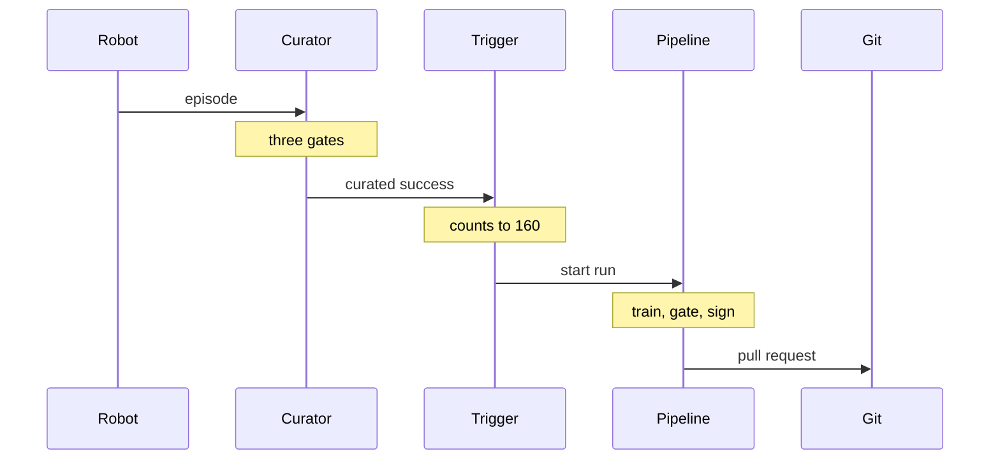

<!-- This project was developed with assistance from AI tools. -->
# Data flow

One episode's path: from a robot's attempt at the task to a pull request that promotes a better policy. The loop as a
whole is on the [flywheel](architecture/flywheel.md) page, and what happens after the merge is on the
[promotion](architecture/promotion.md) page.

## Stage by stage

1. **Episode.** The episode loop homes the arm, re-places the cubes and runs the policy for up to a minute. Success is
   counted from the simulator's ground-truth cube poses, as a running peak: a cube placed and later knocked off still
   counts, as it would to a person watching.
2. **Curation.** The curator applies three gates: the rollout completed, all three cubes are on the tray, the motion
   is smooth. An episode that passes is kept. One that fails keeps its record and loses its frames.
3. **Storage.** The sync agent moves curated episodes to object storage and writes a manifest to Kafka. Each carries
   the model version of the policy that produced it, published by the serving policy itself.
4. **Trigger.** A consumer counts curated successes of the serving model's lineage and starts a pipeline run at 160.
5. **Training.** The pipeline's first stage, `trigger_and_wait`, hands the work to the training runner over Kafka. The
   runner assembles a LeRobot dataset from the curated episodes and fine-tunes the incumbent policy from its own
   weights.
6. **Paired evaluation.** Candidate and incumbent each run the same seeded scenes. The report pairs them scene by
   scene: fixed, broken, unchanged.
7. **Gate.** `eval_gate` passes the candidate only if it fixes more scenes than it breaks and a paired sign test is
   below 0.05. Otherwise the run stops and nothing downstream happens. On 360 paired scenes the promoted policy raised
   task success from 82% to 92% (57 scenes fixed, 19 broken), and the gate promoted it.
8. **Package and sign.** `package_modelcar` packs the weights as an OCI image; `sign_modelcar` signs it with cosign,
   requires its entry in the transparency log and verifies it ([supply chain](architecture/supply-chain.md)).
9. **Register.** `register_model` writes one Model Registry version per candidate: digest, dataset URI, paired
   metrics, log index. The record does not depend on git history.
10. **Pull request.** `open_promotion_pr` opens a pull request whose one commit pins the image's digest and
    `MODEL_VERSION` in both Fleet files, and updates the trigger's lineage and the catalog. `record_pr_url` writes its
    address into the registry version. A person merges it.
11. **Rollout.** Edge Manager rolls the merge to the GPU host and through the twelve robots in batches; every device
    verifies the image before running it ([promotion](architecture/promotion.md)).
12. **Again.** Episodes of the promoted policy carry its version. The next 160 curated successes start the next run,
    fine-tuned from this policy and gated against it.

## Robot zero's episodes

Robot zero, the GPU host as a robot, runs the promoted policy closed loop from ray-traced cameras. Every episode robot
zero runs is scored by the curator's gates and shown on the flywheel page. The scoring is done by a second deployment of
the curator's code with its own small volume ([flywheel](architecture/flywheel.md#the-curators),
[fleet](architecture/fleet.md#robot-zero)).
