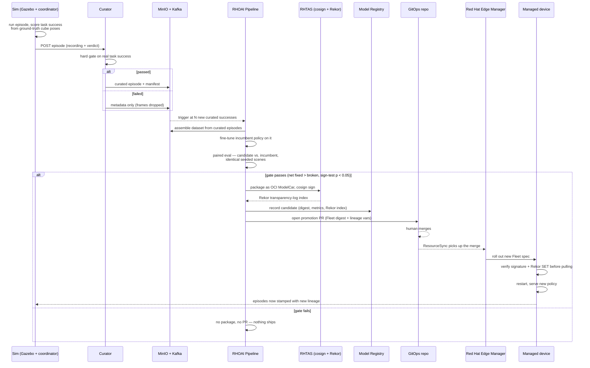

# Data Flow

How an episode becomes training data, how training data becomes a promoted model, and how a
promoted model closes the loop back into the simulator.

## Stage by stage

1. **Episode generation.** The coordinator drives one attempt at the task, scoring it from the
   simulator's own ground-truth cube-pose topic — not a vision classifier, not a heuristic. Cube
   count is tracked as a running peak across the episode (a cube placed then knocked off still
   counts), matching what a human watching would call success.

2. **Curation.** Task success is a hard gate, not a scoring penalty: 3-of-3 cubes placed passes,
   anything else is rejected. A rejected episode keeps its JSON record (for the curation-stream
   narrative and audit trail) but its recorded frames are dropped — it never becomes training data.

3. **Storage.** Curated episodes and their manifests land in MinIO and on a Kafka topic, stamped
   with the model version of the policy that actually produced them (published by the served
   policy itself, not inferred).

4. **Trigger.** A consumer watches the curated stream for a specific lineage and fires a pipeline
   run once enough new successes have accumulated since the last promotion — the platform decides
   to retrain, nobody schedules it by hand.

5. **Training.** The pipeline assembles a LeRobot-format dataset from the curated shards and
   fine-tunes the *incumbent* policy on it — starting from its own weights, not from scratch. The
   candidate is measured against, and produced from, the policy it's trying to replace.

6. **The eval gate — the step that matters.** Candidate and incumbent are each run against the
   *same fixed, seeded set of scenes*, paired scene-by-scene. Promotion requires the candidate to
   fix strictly more scenes than it breaks, at statistical significance (a paired sign test,
   p < 0.05) — not just a higher raw success rate. This gate has real teeth: earlier in this
   project's history, fine-tuning on too little curated data measurably made the policy *worse*,
   and the gate correctly refused to promote it. That result is documented, not hidden — see
   `DECISIONS.md` and the demo runbook's eval numbers.

7. **Packaging and signing.** A candidate that passes is packaged as a signed OCI "ModelCar" image
   (cosign, RHTAS) and its signature is written to a Rekor transparency log. A missing or
   unlogged signature is a hard failure downstream, not a warning — proven by two standing
   negative tests on the device (an unsigned image and a signed-but-unlogged image are both
   rejected).

8. **Registration.** One durable record is written per candidate — digest, dataset URI, paired-eval
   metrics, Rekor index — independent of git history, so provenance survives a squashed branch or
   a rewritten PR.

9. **Promotion PR.** The pipeline opens a pull request that edits exactly two things in git: the
   Fleet's pinned image digest and model-version label, and the trigger's lineage variables in the
   same commit. The diff is small and reviewable by design — a human merges it, which is the
   approval gate in this system. Nothing is auto-merged.

10. **Rollout.** Merging the PR is picked up by a GitOps `ResourceSync`, which renders it into the
    Fleet's desired state. Red Hat Edge Manager rolls the new spec out to the device. The device's
    own trust policy verifies the signature and the transparency-log entry *before it will pull the
    image at all* — the enforcement is on the device, not just at the point the image was built.

11. **The loop closes.** Once the device is serving the new policy, its rollouts flow back through
    the same curator, stamped with the new lineage. When enough new curated successes accumulate,
    the pipeline fires again — fine-tuning from *this* candidate, gated against *this* candidate.

## What's real, and the one place a step is time-compressed

Every stage above runs as described, end to end, on real infrastructure. The one deliberate
shortcut: fine-tuning takes real GPU time and the paired eval touches 100 seeded episodes per
policy, which is not something a live audience watches happen. In a booth demonstration, the
checkpoint and the two evaluation records used are real artifacts from a run that already
completed — and everything downstream of them (the gate decision, packaging, signing, the
transparency-log entry, the registry record, the PR, the merge, the rollout) either replays that
exact governed run or re-runs live against the same pre-trained candidate. Nothing is faked; the
compute-heavy part is compressed so an audience can watch the governance part happen. This is
disclosed explicitly in the demo narration, not glossed over — see `docs/DEMO_RUNBOOK.md`'s
"The one honest shortcut."
