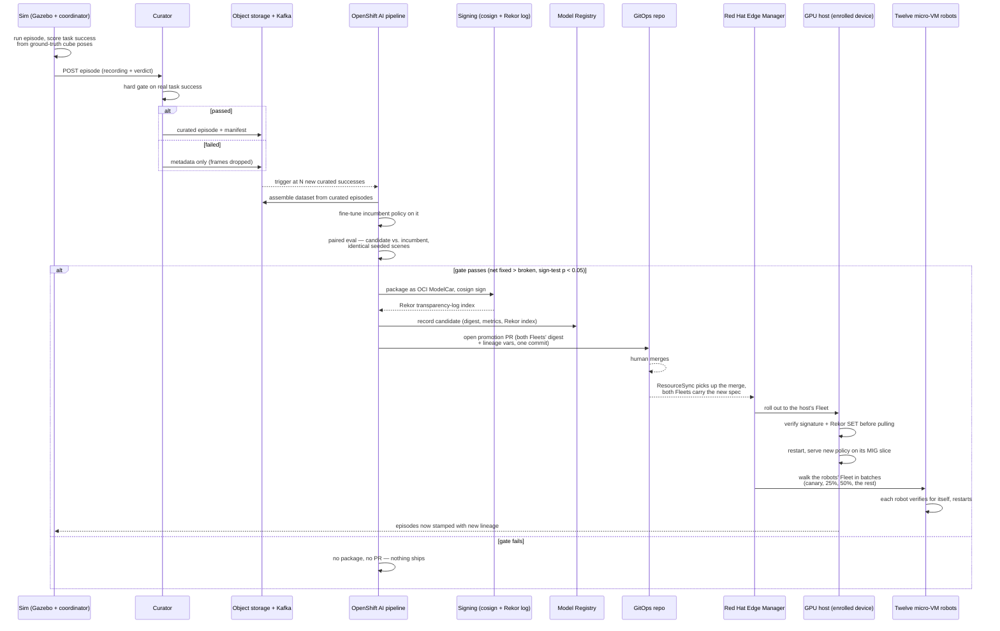
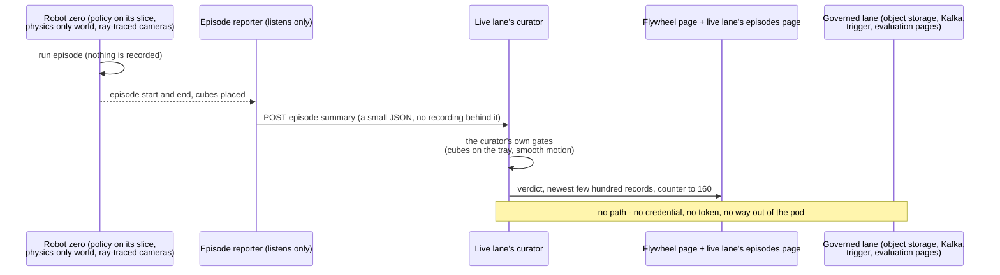

<!-- This project was developed with assistance from AI tools. -->
# Data Flow

How an episode becomes training data, how training data becomes a promoted model, and how a
promoted model reaches every device and closes the loop back into the simulator. There are two
lanes. The **governed lane** is the flywheel itself: what it keeps can become training data. The
**live lane** is what an audience watches all day on the running system: robot zero's episodes,
judged by the same gates and **not kept**.

## The governed lane

## Stage by stage

1. **Episode generation.** The coordinator drives one attempt at the task, scoring it from the
   simulator's own ground-truth cube-pose topic — not a vision classifier, not a heuristic. Cube
   count is tracked as a running peak across the episode (a cube placed then knocked off still
   counts), matching what a human watching would call success.

2. **Curation.** Task success is a hard gate, not a scoring penalty: 3-of-3 cubes placed passes,
   anything else is rejected. A rejected episode keeps its JSON record (for the curation-stream
   narrative and audit trail) but its recorded frames are dropped — it never becomes training data.

3. **Storage.** Curated episodes and their manifests land in object storage and on a Kafka topic, stamped
   with the model version of the policy that actually produced them (published by the served
   policy itself, not inferred).

4. **Trigger.** A consumer watches the curated stream for a specific lineage and fires a pipeline
   run once enough new successes have accumulated since the last promotion — the platform decides
   to retrain, nobody schedules it by hand.

5. **Training.** The pipeline assembles a LeRobot-format dataset from the curated shards and
   fine-tunes the *incumbent* policy on it — starting from its own weights, not from scratch. The
   candidate is measured against, and produced from, the policy it's trying to replace.

6. **The eval gate — the step that matters.** Candidate and incumbent are each run against the
   *same fixed, seeded set of scenes*, paired scene-by-scene. Promotion requires the candidate to
   fix strictly more scenes than it breaks, at statistical significance (a paired sign test,
   p < 0.05) — not just a higher raw success rate. This gate has real teeth: fine-tuning on too
   little curated data measurably made the policy *worse*, and the gate correctly refused to
   promote it. The governed run behind the promotion that is shown: 360 identical seeded scenes,
   295 -> 333 successes (82% -> 92%), 57 scenes fixed and 19 broken, gate PASS. Its evidence is the
   paired evaluation page, pinned to that run.

7. **Packaging and signing.** A candidate that passes is packaged as a signed OCI "ModelCar" image
   (key-based cosign) and its signature is written to the hub's Rekor transparency log. A missing or
   unlogged signature is a hard failure downstream, not a warning — proven by two standing
   negative tests on the device (an unsigned image and a signed-but-unlogged image are both
   rejected).

8. **Registration.** One durable record is written per candidate — digest, dataset URI, paired-eval
   metrics, Rekor index — independent of git history, so provenance survives a squashed branch or
   a rewritten PR.

9. **Promotion PR.** The pipeline opens a pull request whose one commit edits the pinned model
   image digest and model-version label in **both** Fleets' files (`gitops/rhem/`), the trigger's
   lineage variables and the catalog's version list. It refuses when the two Fleets do not hold the
   same model beforehand. The diff is small and reviewable by design — a human merges it, with a
   merge commit, which is the approval gate in this system. Nothing is auto-merged.

10. **Rollout, across both Fleets.** Merging the PR is picked up by a GitOps `ResourceSync`, which
    renders it into both Fleets' desired state. Red Hat Edge Manager rolls the new spec out through
    both: the GPU host - the enrolled device whose policy runs on its own MIG slice - is serving
    the new model first, while the twelve micro-VM robots are walked through their Fleet's batches:
    the canary, up to 25%, up to 50%, the rest, never more than five at once (waves of 1, 2, 3, 5
    and 1). Every device's own trust policy
    verifies the signature and the transparency-log entry *before it will pull the image at all* —
    the enforcement is on the device, not just at the point the image was built. Measured on this
    machine: both Fleets carry the new spec about 45 s after the merge, the host serves the new
    model about a minute and a half after it, and all twelve robots are updated about three and a
    half minutes after it - nothing is pulled when every device already holds both models.

11. **The loop closes.** Once the host is serving the new policy, the governed lane's episodes flow
    back through the same curator, stamped with the new lineage. When enough new curated successes
    accumulate, the pipeline fires again — fine-tuning from *this* candidate, gated against *this*
    candidate.

## The live lane: judged, not kept

The running system stays in one state all day: four tenants on the GPU's four slices, nothing
switched on stage. In that state the episodes an audience watches are **robot zero's**: the same
signed policy Red Hat Edge Manager delivered, on its own MIG slice, driving a physics-only world
whose cameras are ray-traced by the fleet's rendering tenant. They are judged live, by the same
gates, and they are not training data.

- **A separate curator, not a flag.** The live lane's curator is a second Deployment of the
  curator's own code. It has its own small throwaway volume, no object storage or Kafka setting, no
  credential, no service account token, and a network policy that lets nothing out of the pod. The
  reporter on the host is held to that one address. So robot zero's episodes cannot reach object
  storage, the trigger's count, the collection's record or the paired evaluation page.
- **The verdict is honest.** The gates judge physics - were the cubes placed on the tray, was the
  motion smooth - not pixels, so they need no exception for rendered cameras.
- **What the page says.** "live lane: judged, not kept". The counter climbs to 160 and says that
  this is where a governed training run would start; on the live lane nothing was kept and nothing
  is started, and the count begins again. The live lane's own episodes page shows the running
  success rate by model label.
- **What is never claimed.** What the audience watches did not train the promoted model. It is the
  system that produced that promotion, still running.

## What is live, and what is a record

Fine-tuning takes real GPU time and a paired evaluation runs 360 seeded scenes per policy - hours,
never something a live audience watches happen. So a showing is put together like this, and says
so:

| Stage | What is shown | Live? |
|---|---|---|
| Collect | robot zero on the live lane: episodes judged, not kept | live |
| Train | the training tenant: real fine-tunes in rounds on its own slice; nothing from them is promoted | live |
| Evaluate, gate | the governed run's paired evaluation, on the evaluation page pinned to that run | recorded results in a live page |
| Promote | a pull request re-opened for the showing: the same signed image and transparency-log entry, the same gate record - the pipeline did not run again and nothing was re-measured; the merge and the rollout across both Fleets happen in front of the audience | live |

Nothing is faked. The pull request's own first sentence says what it is, and the presenter says it
out loud - see `docs/FURY-DEMO.md`.
