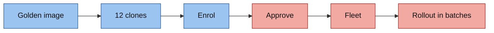
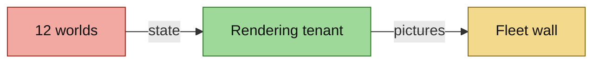
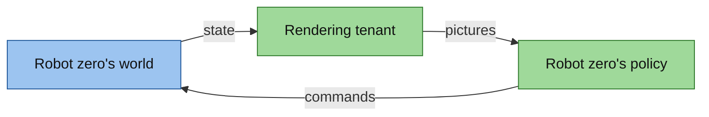

<!-- This project was developed with assistance from AI tools. -->
# The fleet

Thirteen devices under Red Hat Edge Manager: the GPU host, which is robot zero, and twelve RHEL image mode robots. This
page covers how a robot comes to exist, how the Fleet updates it, and how thirteen arms end up on one wall. Part of the
[architecture](../ARCHITECTURE.md).

## From an image to a Fleet

- **Golden image.** RHEL image mode: the RHEL 10.2 bootc base plus the Edge Manager agent, podman, cloud-init and a
  firewall (`tools/host/fury/fleet/Containerfile`), turned into a disk by bootc-image-builder
  (`tools/host/fury/80-fleet-golden.sh`). The image builds in 34 s and its disk in 65 s, under 1 GB. It holds no
  application image and no secret, and the build fails if it holds anything that belongs to one device.
- **Clones.** `tools/host/fury/81-fleet-scale.sh <N>` means N robots running. Each is a copy-on-write overlay of the
  golden image: 2 vCPUs, 3 GiB, a 40 GiB thin disk, a fixed address and MAC per number. Every clone gets its own host
  key, device identity and hardware id. The script starts and shuts down and never deletes: a robot that was shut off
  comes back with its identity in about a minute, without approval and without a pull.
- **Enrol.** The enrolment config reaches a clone through a cloud-init seed that is ejected and shredded after the
  first boot. The agent then asks Edge Manager to enrol the device.
- **Approve.** `tools/hub/fleet-approve.sh` approves only requests that look exactly like a clone this host made -
  name, address, MAC, architecture, age - and sets the labels Fleet `robots` selects on. The lowest number becomes the
  canary.
- **Fleet.** The Fleet delivers the trust files, a Zenoh router and the signed policy on CPU, with the model image as
  an image volume. Each robot pulls its images itself and verifies them ([supply chain](supply-chain.md)).

Twelve robots were enrolled, approved and healthy about 25 minutes after the first one booted.

## Batches

| Fleet | Devices | Batches |
|---|---|---|
| `act-inference` | the GPU host | one device |
| `robots` | the twelve robots | the canary, then up to 25% of the Fleet, then up to 50%, then the rest; never more than five at once |

With twelve robots a model rollout runs in waves of 1, 2, 3, 5 and 1. Batches govern changes to the template; a newly
approved robot gets the current template at once. The two Fleets are separate so that a slow micro-VM cannot hold up
the GPU host, and so that a two-vCPU CPU device can have its own settings. More:
[`gitops/rhem/README.md`](../../gitops/rhem/README.md), [`FLEET-VMS.md`](../internal/FLEET-VMS.md).

## The wall

Each robot has a world: a physics-only simulation of its arm, its three cubes and its tray. The worlds are pods on the
hub - StatefulSet `world` in namespace `fleet`, pod ordinal N for robot `r<N+1>` - each with its own network namespace,
Zenoh router and Gazebo partition, no ingress and a read-only root. `tools/hub/fleet-worlds-scale.sh` sizes the set.

Each robot's world replays recorded policy motion; robot zero runs the policy closed loop from its ray-traced cameras.
`tools/fleet/extract_trajectories.py` makes the motion file the worlds replay from a dataset's recorded actions.

A world sends its state to the rendering tenant about 30 times a second: one UDP datagram of JSON with six joint
positions, three cube poses and its simulation time. The renderer keeps the latest state per robot and never queues. It
ray-traces both cameras of every robot in one batch per tick and serves the pictures over HTTP; the fleet wall is a
mosaic of every robot's overhead camera behind Route `fleet-wall`. A robot that goes quiet for 5 s is greyed out and
leaves the wall after 60 s. Either half restarts without the other noticing more than a stale tile. Full text:
[`FLEET-RENDER-CONTRACT.md`](../internal/FLEET-RENDER-CONTRACT.md).

## Robot zero

The GPU host is the fleet's first robot, `r00` on the wall. Its policy is the application of Fleet `act-inference`,
placed on MIG slice `0:1` by a device label ([GPU tenants](gpu-tenants.md)). The host adds the robot around the policy:
four podman units without a GPU, each with a read-only root, no capabilities and no credentials
(`tools/host/fury/74-robot-zero.md`).

| Unit | What it does |
|---|---|
| `robot-zero-sim` | the physics-only world, the Zenoh router the policy connects to, and the forwarder that reports state to the renderer as `r00` |
| `robot-zero-frames` | fetches `r00`'s two pictures from the renderer and publishes them on the policy's image topics, 15 a second |
| `robot-zero-episodes` | the episode loop with `RECORD=false`: homes the arm, re-places the cubes, runs the policy for up to a minute, repeats |
| `robot-zero-emitter` | posts one small JSON summary per episode to the curator that scores robot zero ([flywheel](flywheel.md)) |

`tools/hub/robot-zero.sh` brings robot zero up, resets it and reports its status. The first full episode on ray-traced
cameras placed all three cubes in 59 s, with no tuning of the policy.
