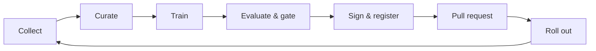
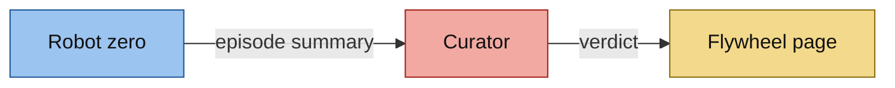

<!-- This project was developed with assistance from AI tools. -->
# The flywheel

How a policy gets better and how the better policy gets out: episodes become curated data, curated data becomes a
candidate, the candidate has to beat the incumbent, and what passes is signed and proposed as a pull request.
Part of the [architecture](../ARCHITECTURE.md).

| Step | What happens |
|---|---|
| Collect | the episode loop (`src/inference-coordinator`) homes the arm, re-places the cubes, runs the policy for up to a minute and records the episode |
| Curate | the curator scores the episode and keeps it only if it passes every gate |
| Train | the pipeline fine-tunes the incumbent policy on the curated episodes, starting from the incumbent's weights |
| Evaluate & gate | candidate and incumbent run the same seeded scenes; the gate compares them scene by scene |
| Sign & register | the model becomes a signed OCI image with a transparency-log entry and a Model Registry version |
| Pull request | one commit pins the new image in both Fleets; a person merges it |
| Roll out | Edge Manager takes the merge to the GPU host and the twelve robots ([promotion](promotion.md)) |

The loop closes when the promoted policy is the one collecting: its episodes carry its model version, and the next
candidate is fine-tuned from it and gated against it.

## The curators

The curator (`gitops/flywheel/curator.yaml`) receives one record per episode and applies three gates. They judge
physics, not pixels.

| Gate | Question |
|---|---|
| Completeness | did the rollout run to its end without a simulator error? |
| Task success | are all three cubes on the tray? Counted from the simulator's ground-truth cube poses, as a running peak |
| Smoothness | is the joint motion smooth rather than jerky? |

An episode that passes goes through the sync agent to object storage, and its manifest goes to Kafka, stamped with the
model version of the policy that produced it. An episode that fails keeps its record and loses its frames.

A second deployment of the same code, `curator-show`, scores robot zero. Every episode robot zero runs is scored by
the curator's gates and shown on the flywheel page, with robot zero's two cameras, the latest verdict and a counter to
160. This deployment has its own small volume, its own service account, no credentials and no network egress, and it
accepts connections from the GPU host only. It keeps the newest 300 records of each verdict for the page.

Both deployments run ConfigMap `curator-code` at the same revision; `tests/hub/test_show_lane.py` holds the second
one's isolation in place.

## The trigger

`gitops/flywheel/manifest-consumer.yaml` counts curated successes of the serving model's lineage on Kafka and starts a
pipeline run at 160. The platform decides when to retrain; nobody schedules it.

## The pipeline

`pipeline/act_flywheel_pipeline.py`, run by OpenShift AI's Data Science Pipelines.

| Stage | What it does |
|---|---|
| `trigger_and_wait` | hands training and the paired evaluation to the training runner (`src/host-runner`) over Kafka and waits for its artifacts in object storage: a checkpoint, two evaluation records, the paired report |
| `eval_gate` | reads the paired report and stops the run unless the candidate passes |
| `package_modelcar` | packs the weights as an OCI image for `linux/amd64` and `linux/arm64` under one index; every run's image keeps a tag no later run moves |
| `sign_modelcar` | signs with cosign and the hub's key, requires an entry in the transparency log, then verifies; a signature without a log entry stops the run |
| `register_model` | writes one Model Registry version per candidate: digest, dataset URI, paired metrics, log index |
| `open_promotion_pr` | opens the pull request: one commit with the image's digest and `MODEL_VERSION` in both Fleet files, the trigger's lineage and the catalog item |
| `record_pr_url` | writes the pull request's address into the registry version |

## The gate

Candidate and incumbent each run the same fixed, seeded scenes, and the results are paired scene by scene. A scene the
incumbent failed and the candidate solved is *fixed*; the reverse is *broken*. The gate passes only when fixed minus
broken is above zero and a paired sign test is below 0.05. A higher raw success rate is not enough.

On 360 paired scenes the promoted policy raised task success from 82% to 92% (295 to 333 scenes; 57 fixed, 19 broken),
and the gate promoted it.

## The pages

| Page | Shows |
|---|---|
| Flywheel page | robot zero's cameras, the latest verdict, the counter to 160 |
| Paired evaluation | candidate against incumbent for one pipeline run: success rates, fixed and broken scenes, the sign test, the gate's verdict |
| Live episodes | the curated and rejected episodes, by model version; one instance per curator |

The three evaluation pages are instances of one signed image (`src/eval-dashboard`) pinned by one digest. The paired
evaluation page reads object storage through a read-only user.
