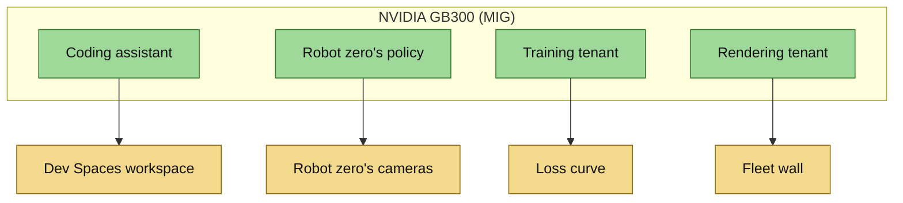

<!-- This project was developed with assistance from AI tools. -->
# One GPU, four tenants

The workstation has one NVIDIA GB300. MIG splits it into four slices, each with its own compute and memory, and each
slice has one tenant. Part of the [architecture](../ARCHITECTURE.md).

Below each tenant is the place where you watch it work.

| Slice | Tenant | What it runs | Delivered by |
|---|---|---|---|
| `0:0` (3g.126gb) | Coding assistant | a Qwen coder model served by vLLM: tool calling, 131k context | a podman unit on the host |
| `0:1` (1g.31gb) | Robot zero's policy | the signed ACT policy, closed loop on ray-traced cameras | Edge Manager, Fleet `act-inference` |
| `0:2` (1g.31gb) | Training tenant | ACT fine-tunes with `lerobot-train`, round after round | a podman unit on the host |
| `0:3` (1g.31gb) | Rendering tenant | MuJoCo-Warp ray tracing of every robot's two cameras | a podman unit on the host |

## MIG on this machine

The layout is `3g.126gb` + `1g.31gb` + `1g.31gb` + `1g.31gb`, addressed as CDI devices `nvidia.com/gpu=0:0` to `0:3`.
MIG mode and its instances do not survive a reboot on this GPU, so `mig-config.service` re-creates the layout at every
boot. One command makes it in one order, so the GPU instance ids (1, 11, 12, 13) and the MIG UUIDs repeat from boot to
boot. The dashboard's slice names and robot zero's placement rely on that.

A MIG slice is compute only: there is no OpenGL on it, so a simulator cannot render its own cameras there. Every world
in the system is therefore physics only, and the rendering tenant ray-traces the cameras with CUDA from the state the
worlds send it ([fleet](fleet.md)).

`fury-mode` (`tools/host/fury/fury-mode.sh`) owns the GPU's mode and every tenant's unit. `fury-mode tenants` creates
the slices and starts the tenants, and a boot in that mode brings them back. A GPU unit does not start while its CDI
device is absent. `fury-mode flywheel` turns MIG off and gives the whole GPU to a simulator that renders its own
cameras; it stops every tenant first, because the GPU must be idle to change mode.

## The tenants

**Coding assistant, slice `0:0`.** vLLM serves `qwen3-coder-next` on `10.20.0.1:8000` with an OpenAI-compatible API.
The image is pinned by digest and the model is read from local storage. In the cluster it is Service
`assistant.flywheel.svc:8000`, reachable from pods only: a Dev Spaces workspace (`devfile.yaml`, `src/dev-workspace`)
whose terminal coding agent edits files and runs tests against it. It answers at about 245 tokens a second for a single
stream, with the first token after about 0.13 s.

**Robot zero's policy, slice `0:1`.** The one tenant that is not a host unit: the `act-inference` application of Fleet
`act-inference`, delivered, verified and started by the Edge Manager agent. The Fleet's template names the GPU device
from the device's `gpu_device` label, and `tools/hub/robot-zero.sh up` sets that label to the MIG UUID of slice `0:1`.
The robot around the policy is described on the [fleet](fleet.md) page.

**Training tenant, slice `0:2`.** A fixed list of eight configurations - start checkpoint, learning rate, seed - run as
rounds of 9000 steps, over and over, at about 10 steps a second; a round takes about a quarter of an hour. It is the
GPU's standing training load. The unit has no network, mounts its dataset and start checkpoints read-only, writes to
one directory of its own, and carries a CPU quota and a memory ceiling (`tools/host/fury/72-training-tenant.md`).

**Rendering tenant, slice `0:3`.** One process (`src/fleet-renderer`) ray-traces both cameras of every robot it has
heard from, in one batch per tick: 480x480, 15 frames a second, shadows on, room for 24 robots. It listens on
`10.20.0.1:9701/udp` for state and serves pictures on `10.20.0.1:9702/tcp`. The slice renders about 228 camera pairs
a second, and the pictures match the simulator's camera geometry to 0.09 px. The image is built on the host from
`docker/Dockerfile.fleet-renderer` and runs non-root with every capability dropped
(`tools/host/fury/73-fleet-renderer.md`).

## Isolation

MIG gives each slice its own compute and memory. The coding assistant decodes 246.6 tokens a second while the
training tenant trains on the neighbouring slice, and 245.7 with that slice idle. Time to first token is 0.135 s against
0.132 s.

## Watching the tenants

| Source on the host | Port | What it reports |
|---|---|---|
| NVIDIA DCGM exporter | `10.20.0.1:9400` | compute and memory per slice, power, temperature |
| Tenant metrics exporter (`src/tenant-metrics`) | `10.20.0.1:9401` | training loss, step, steps a second, round; renderer frames a second, robots live |
| vLLM | `10.20.0.1:8000/metrics` | tokens a second, requests running |

The hub's Prometheus scrapes all three as static targets and keeps seven days. Perses draws the *GPU tenants*
dashboard from them: every slice named by its tenant, each tenant's headline number beside its GPU panels. The names
are a map of GPU instance ids, and `./75-tenant-metrics-install.sh slices` on the host checks that map against the GPU
row by row (`tools/host/fury/75-tenant-metrics.md`). `tools/hub/training-watch.sh` shows the training tenant's output
in a terminal.
