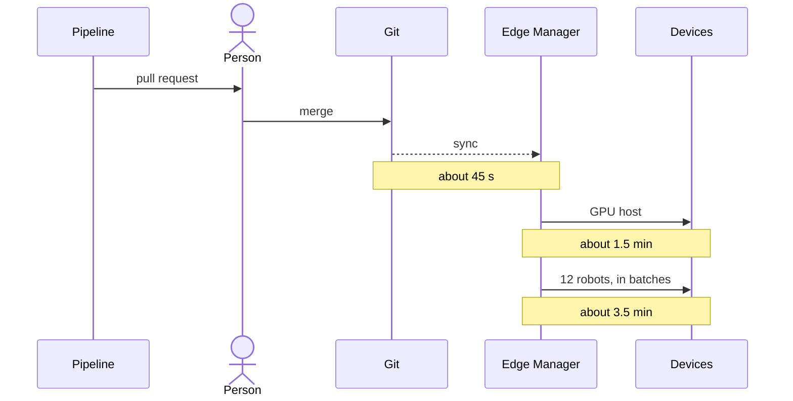

<!-- This project was developed with assistance from AI tools. -->
# Promotion

A promotion is one commit: the digest of a signed model image and its version, in both Fleets. The pipeline proposes
it, a person merges it, and Edge Manager rolls it to thirteen devices. Part of the [architecture](../ARCHITECTURE.md).

Times count from the merge.

## The pull request

The pipeline's last stage, `open_promotion_pr`, opens it after the gate has passed and the image is signed, logged and
registered ([flywheel](flywheel.md)). It is one commit over four files:

| File | What changes |
|---|---|
| `gitops/rhem/fleet-act-inference.yaml` | the model image's digest and `MODEL_VERSION`, for the GPU host |
| `gitops/rhem/fleet-robots.yaml` | the same two lines, for the twelve robots |
| `gitops/flywheel/manifest-consumer.yaml` | the lineage the trigger counts, so the next run builds on this model |
| the catalog item in `gitops/rhem-catalog/` | the new version, added to the version graph |

The stage refuses when the two Fleet files do not pin the same model beforehand, and
`tests/pipeline/test_open_promotion_pr.py` fails when they disagree. The pull request's text carries the gate's table
and the image's digest. A person reviews and merges it with a merge commit. Nothing merges itself.

## The rollout

Edge Manager syncs `gitops/rhem/` itself, through a `ResourceSync`, and Argo CD syncs the trigger's new lineage from
the same commit.

| After the merge | What has happened |
|---|---|
| about 45 s | both Fleets carry the new template; devices start to update, the GPU host first |
| about 1.5 min | the GPU host serves the promoted model on its MIG slice |
| 1.5 to 3.5 min | the robots update in batches: the canary, up to 25%, up to 50%, the rest - waves of 1, 2, 3, 5 and 1 |
| about 3.5 min | twelve of twelve robots run the promoted model and all thirteen devices are healthy |

In detail: the GPU host was serving 1 min 38 s after the first merge and 1 min 32 s after a later one; all twelve
robots were updated at 3 min 23 s and all thirteen devices healthy at 3 min 39 s. A device that already holds the model
image pulls nothing. One that does not pulls it under its signature policy ([supply chain](supply-chain.md)).

## Rollback

Rollback is a `git revert` of the merge commit. Edge Manager rolls the previous template out the same way, the GPU
host first and the robots in batches. The previous image is still on every device, so nothing is pulled.

## Showing it again

Two scripts repeat the promotion between showings of the demo. Both are run from a laptop with a checkout, `oc`,
`flightctl`, `gh` and `jq`.

| Script | What it does |
|---|---|
| `tools/hub/reset-promotion.sh` | reverts the newest promotion's merge commit and watches both Fleets return to the previous model: the GPU host after about 50 s, all thirteen devices healthy in about 5 min |
| `tools/hub/reopen-promotion.sh --open` | opens a new pull request that proposes the same signed image again, quoting the original pull request's text; its title ends in "re-opened for a showing" |

The reset finds a promotion by its merge commit, which is why a promotion is merged with a merge commit. The evaluation
records, the Model Registry version and the signed images stay as the pipeline made them. Both scripts refuse while a
rollout is in progress or a robot is shut off, because a robot that is off holds its batch until the 30-minute timeout.
`tools/hub/start-promotion-run.sh` starts a full pipeline run by hand, the way the trigger would.
