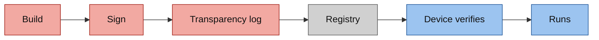

<!-- This project was developed with assistance from AI tools. -->
# The supply chain

Every image the project builds is signed on the hub, entered in a transparency log, and checked on the device that runs
it. The check is made by the device, at pull time. Part of the [architecture](../ARCHITECTURE.md).

## Build

An OpenShift Pipelines pipeline on the hub (`gitops/tekton/`) clones the repository, builds with buildah, pushes, signs
and verifies. It can build an amd64 and arm64 manifest list; the hub's build scripts (`tools/hub/build-eval-dashboard.sh`,
`tools/hub/build-dev-workspace.sh`, `tools/hub/build-fleet-world.sh`) build `linux/arm64` natively. Each prints the new
digest and where to pin it.

| Image | Built from | Built by |
|---|---|---|
| Runtime: the policy, the episode loop, the training tenant | `docker/Dockerfile.gpu-inference` | the hub's pipeline, multi-arch |
| Simulation: the robots' worlds, robot zero's world | `docker/Dockerfile` | the hub's pipeline |
| Model | the promotion pipeline's `package_modelcar` stage | the promotion pipeline ([flywheel](flywheel.md)) |
| Evaluation pages | `src/eval-dashboard/` | the hub's pipeline |
| Coding workspace | `src/dev-workspace/` | the hub's pipeline |
| Fleet renderer | `docker/Dockerfile.fleet-renderer` | on the GPU host |
| Robots' operating system | `tools/host/fury/fleet/Containerfile` | on the GPU host |

The Fleets, the host's units and the hub's workloads pin the project images they pull by digest.

## Sign and log

Signing is key-based cosign (2.6.5; its release checksum is verified before it runs). The key pair is a Secret on the
hub, created by hand with `tools/hub/create-cosign-secrets.sh`. Every signature gets an entry in the hub's transparency
log: Rekor on Trillian, built for arm64 from the public source of Red Hat Trusted Artifact Signer 1.4.3
(`tools/host/fury/rhtas-arm64/`). The promotion pipeline stops a run whose signature has no log entry.

## Verify on the device

Each Fleet writes four trust files to its devices: `/etc/containers/policy.json`, a `registries.d` entry, the cosign
public key and the log's public key.

| Image source | What the device requires |
|---|---|
| the project's two image repositories | a valid signature by the project's key and a valid transparency-log entry, matched to the repository |
| Red Hat's registries | a valid signature by Red Hat's release key |
| anything else, on a robot | rejected |

So a robot runs only signed images, and each of the thirteen devices makes that check itself. The model
image reaches the policy as an image volume, under the same policy. The host units outside the Fleets - the coding
assistant's vLLM image and the DCGM exporter - pin their images by digest.
